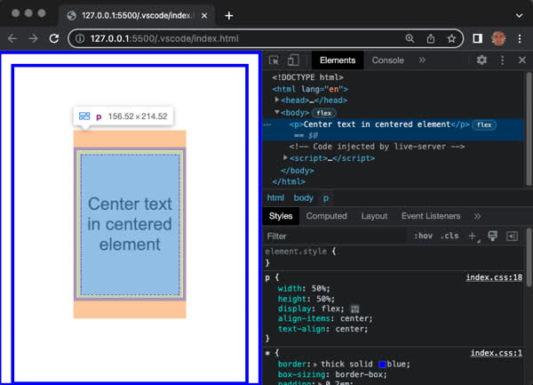

# Debugging CSS

📖 **Suggested reading**: [MDN Debugging CSS](https://developer.mozilla.org/en-US/docs/Learn/CSS/Building_blocks/Debugging_CSS)

CSS is extremely flexible and powerful, but sometimes is can be very frustrating to figure out what why your page is not rendering the way that you expect. To help you understand why things are rendering the way that they do you can use the browser's developer tool to inspect the CSS properties and visualize the HTML element layout. Using the Google Chrome debugger you can access the developer tools by right click on the HTML page element that you want to debug and select the `inspect` option. We can try this out by creating a directory that contains HTML (`index.html`) with a paragraph of text, and a CSS file (`index.css`) that uses flex to center the text in the CSS.

```html
<!DOCTYPE html>
<html lang="en">
  <head>
    <meta name="viewport" content="width=device-width, initial-scale=1.0" />
    <link rel="stylesheet" type="text/css" href="index.css" />
  </head>
  <body>
    <p>Center text in centered element</p>
  </body>
</html>
```

```css
* {
  border: thick solid blue;
  box-sizing: border-box;
  padding: 0.2em;
  margin: 0;
  font-size: 24px;
  font-family: Arial;
}
html {
  height: 100%;
}
body {
  display: flex;
  align-items: center;
  justify-content: center;
  height: 100%;
  overflow: hidden;
}

p {
  width: 50%;
  height: 50%;
  display: flex;
  align-items: center;
  text-align: center;
}
```

Open the directory with VS Code and use the live server extension to view the HTML in the Chrome browser. In the browser, right click on the text and select `inspect`. This will open the debugger window and display the `Elements` tab. As you move your cursor over the the different elements to visually see what the padding, borders, and margins are set to. The `Styles` pane shows all of the CSS properties applied to the currently selected element. If you scroll down the the bottom of the styles pane you will see the CSS box. By moving the cursor over the different parts of the CSS box it will highlight the the different box parts in the browser window.



You can change any of the CSS properties, and even add new properties, directly in the debugger. This allows you to see what each property is contributing and change them to see how that impacts the rendering. This is a great way to figure out what CSS works best without having to continually change the CSS file and refresh the browser.

This example has a small problem. Each element in the CSS is wrapped with a blue border with some padding. But the body element does not render any border at the bottom. Inspecting the body element and looking at the CSS box shows that the default margin for the elements is pushing the body element down so that the padding overflows its parent element. We can fix this by setting the margin for elements to be zero.


Experiment with debugging and altering the CSS. You can do this with any website to see how they implemented their design and do temporary alterations to how it renders.
