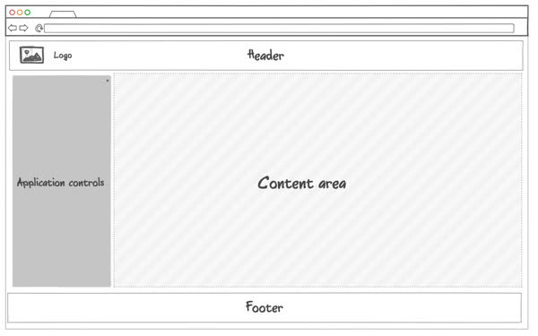
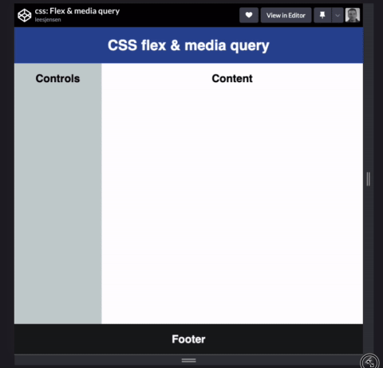

# CSS Flexbox

**Recommend reading**: [MDN Flexbox](https://developer.mozilla.org/en-US/docs/Web/CSS/CSS_Flexible_Box_Layout/Basic_Concepts_of_Flexbox)

The `flex` display layout is useful when you want to partition your application into areas that responsively move around as the window resizes or the orientation changes. In order to demonstrate the power of flex we will build an application that has a header, footer, and a main content area that is split into two sections, with controls of the left and content on the right.

So we can visualize our design by quickly sketching it out.



Next we build our structural HTML to match our design.

```html
<body>
  <header>
    <h1>CSS flex &amp; media query</h1>
  </header>
  <main>
    <section>
      <h2>Controls</h2>
    </section>
    <section>
      <h2>Content</h2>
    </section>
  </main>
  <footer>
    <h2>Footer</h2>
  </footer>
</body>
```

Now we can use Flexbox to make it all come alive. We make the body element into a responsive flexbox by including the CSS `display` property with the value of `flex`. This tells the browser that all of the children of this element are to be displayed in a flex flow. We want our top level flexbox children to be column oriented and so we add the `flex-direction` property with a value of `column`. We then add some simple other declarations to zero out the margin and fill the entire viewport with our application frame.

```css
body {
  display: flex;
  flex-direction: column;
  margin: 0;
  height: 100vh;
}
```

To get the division of space for the flexbox children correct we add the following flex properties to each of the children.

- **header** - `flex: 0 80px` - Zero means it will not grow and 80px means it has a starting basis height of 80 pixels. This creates a fixed size box.
- **footer** - `flex: 0 30px` - Like the header it will not grow and has a height of 30 pixels.
- **main** - `flex: 1` - One means it will get one fractional unit of growth, and since it is the only child with a non-zero growth value, it will get all the remaining space. Main also gets some additional properties because with want it to also be a flexbox container for the controls and content area. So we set its display to be `flex` and specify the `flex-direction` to be row so that the children are oriented side by side.

```css
header {
  flex: 0 80px;
  background: hsl(223, 57%, 38%);
}

footer {
  flex: 0 30px;
  background: hsl(180, 10%, 10%);
}

main {
  flex: 1;
  display: flex;
  flex-direction: row;
}
```

Now we just need to add CSS to the control and content areas represented by the two child section elements. We want the controls to have 25% of the space and the content to have the remaining. So we set the `flex` property value to 1 and 3 respectively. That means that the controls get one unit of space and the content gets three units of space. No matter how we resize things this ratio will responsively remain.

```css
section:nth-child(1) {
  flex: 1;
  background-color: hsl(180, 10%, 80%);
}
section:nth-child(2) {
  flex: 3;
  background-color: white;
}
```

## Media Query

That completes our original design, but we also want to handle small screen sizes. To do this, we add some media queries that drop the header and footer if the viewport gets too short, and orients the main sections as rows if it gets too narrow.

To support the narrow screen (portrait mode), we include a media query that detects when we are in portrait orientation and sets the `flex-direction` of the main element to be column instead of row. This causes the children to be stacked on top of each other instead of side by side.

To handle making our header and footer disappear when the screen is to short to display them, we use a media query that triggers when our viewport height has a maximum value of 700 pixels. When that is true we change the `display` property for both the header and the footer to `none` so that they will be hidden. When that happens the main element becomes the only child and since it has a flex value of 1, it takes over everything.

```css
@media (orientation: portrait) {
  main {
    flex-direction: column;
  }
}

@media (max-height: 700px) {
  header {
    display: none;
  }
  footer {
    display: none;
  }
}
```

Here is what the finished application looks like.



You can experiment with this on [CodePen](https://codepen.io/leesjensen/pen/MWOVYpZ).

## Flexbox Froggy

[Flexbox Froggy](https://flexboxfroggy.com/) is an interactive tutorial where you use Flexbox css properties to move a frog onto a lilly pad. If you would like to understand Flex better, you might want to check it out.

## ☑ Assignment

Now it is your turn to build a fully responsive application. You can use Grid and/or Flexbox along with media queries to build something that stretches you. After you are done experimenting with the above example, take some time to sketch out your design. Once you are done coding, submit your CodePen URL, along with a comment about something you found interesting, to the Canvas assignment.

Don't forget to update your GitHub start up repository README.md with all of the things you learned and want to remember.
