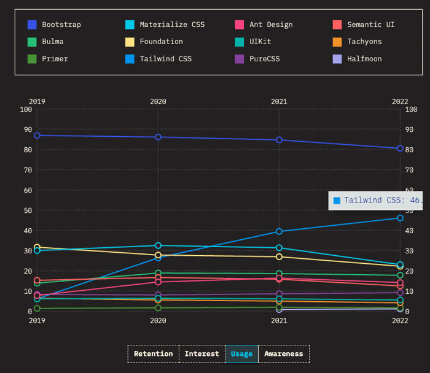
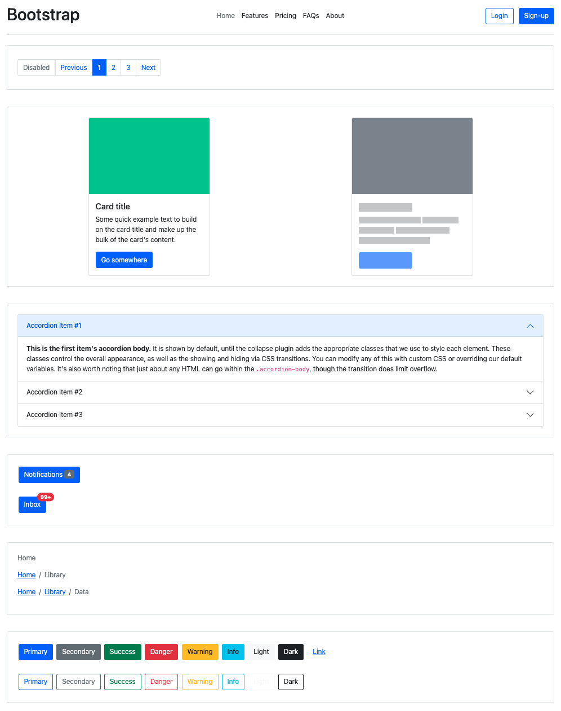

# CSS Frameworks

CSS frameworks contain practices, functions, and components that commonly appear in web applications. As web developers built more and more web application they began to use the same patterns over and over. This helped not only decrease the time to develop an application, but created a common user experience for the web in general.

Today, there are lots of different open source CSS frameworks available to choose from. Many of them contain the same types of functionality, but they all bring something a little different to the table.



\- **Source**: [_StateOfCSS CSS framework poll_](https://2021.stateofcss.com/en-US/technologies/css-frameworks)

## Tailwind

A new rising contender in the CSS framework space is [Tailwind CSS](https://tailwindcss.com/) and its associated component library [Tailwind UI](https://tailwindui.com/). In the last StateOfCSS poll Tailwind gained an impressive 40% general usage ranking, all within three years. Tailwind takes a very different approach than traditional CSS frameworks. Instead of using large, rich, CSS rulesets to compartmentalize styling and functionality, it uses smaller definitions that are applied specifically to individual HTML elements. This moves much of the CSS representation out of the CSS file and into the HTML.

## Bootstrap

📖 **Required reading**: [Getting started with Bootstrap](https://getbootstrap.com/docs/5.2/getting-started/introduction/)

The reigning champion for CSS frameworks is [Bootstrap](https://getbootstrap.com/). Bootstrap has been an active an vibrant community for over a decade and contains many lessons from real world applications. The major downside of Bootstrap is its own success. Because it is so popular, Bootstrap defines the de facto look and feel of websites. This is great for user experience continuity, but it makes it difficult for a website to grab the attention of new users.

### Getting bootstrap

You can integrate Bootstrap into your web applications simply by referencing the Bootstrap CSS files from their [content delivery network](https://getbootstrap.com/docs/5.2/getting-started/introduction/#cdn-links) (CDN). You add the HTML link elements to your head element like this.

```html
<!DOCTYPE html>
<html lang="en">
  <head>
    <meta name="viewport" content="width=device-width, initial-scale=1" />
    <link
      href="https://cdn.jsdelivr.net/npm/bootstrap@5.2.3/dist/css/bootstrap.min.css"
      rel="stylesheet"
      integrity="sha384-rbsA2VBKQhggwzxH7pPCaAqO46MgnOM80zW1RWuH61DGLwZJEdK2Kadq2F9CUG65"
      crossorigin="anonymous"
    />
  </head>
  <body>
    ...
  </body>
</html>
```

If you are going to use Bootstrap interactive components that require JavaScript (carousel, buttons, and more), you will also need to include Bootstrap's JavaScript module. You add this by putting the following at the end of your HTML body element.

```html
<body>
  ...

  <script
    src="https://cdn.jsdelivr.net/npm/bootstrap@5.2.3/dist/js/bootstrap.bundle.min.js"
    integrity="sha384-kenU1KFdBIe4zVF0s0G1M5b4hcpxyD9F7jL+jjXkk+Q2h455rYXK/7HAuoJl+0I4"
    crossorigin="anonymous"
  ></script>
</body>
```

Later on when we introduce the idea of bundling your application you will want to use the Node Package Manager (NPM) to download Bootstrap and include it in your source code so that you don't have to rely on someone elses server to provide you with a vital piece of your application. To include Bootstrap in your application using NPM you would run the following from your console.

```sh
npm i bootstrap@5.2.3
```

⚠ Note that those links are version specific (version 5 in this case). You will want to get the latest version links when you begin building your application.

### Using bootstrap

Once you have Bootstrap linked to your HTML files you can begin using the components it provides. Let's start with a simple button. Because we use the Bootstrap `btn` CSS class, the button gets a nice looking rounded button. The Bootstrap `btn-primary` CSS class shades the button with the current primary color for the application, which is blue. The following demonstrates the difference between a Bootstrap style button and a plain vanilla button. Functionally the both work exactly the same. The Bootstrap button is just a lot easier on the eyes.

```html
<button type="button" class="btn btn-primary">Bootstrap</button>
<button type="button">Plain</button>
```


This [CodePen](https://codepen.io/leesjensen/pen/JjZavjW) demonstrates the use of all the major Bootstrap components. Notice the rich diversity of functionality it provides and that it is fully responsive. The image below only captures a few of the components.



## ☑ Assignment

Now that you have experience with Bootstrap you can build a simple home page using Bootstrap components. Fork this [CodePen](https://codepen.io/leesjensen/pen/wvXEmVQ) and experiment with it. Remove the components it demonstrates and replace it with some other Bootstrap components. When you are done upload the URL of your CodePen with a description of what you found interesting to the Canvas assignment.
