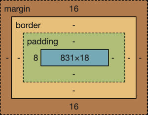

# Cascading Style Sheets


📖 **Deeper dive reading**: [MDN CSS](https://developer.mozilla.org/en-US/docs/Web/CSS)

Cascading Style Sheets (CSS) converts the structure and content of HTML into a vibrant, responsive, experience. The initial objective of CSS was to simply style the HTML based upon the desires of the user, developer, and browser. In modern web applications CSS styling focuses more on helping the developer create complex renderings of dynamic content that is responsive to the actions of the user and the device the application is rendered on. With CSS a web programmer can animate the page, deploy custom fonts, respond to user actions, and dynamically alter the entire layout of the page based on the size of a device and its orientation.

Functionally, CSS is primarily concerned with defining `rulesets`, or simply a `rules`. A rule is comprised of a `selector` that selects the elements to apply the rule to, and one or more `declarations` that represent the `property` to style with the given `property value`.


For example, consider the following rule.

```css
p {
  font-family: sans-serif;
  font-size: 2em;
  color: navy;
  text-shadow: 3px 3px 1px #cccccc;
}
```

The selector `p` selects all paragraph elements in the HTML document. The four specified declarations then: 1) change the font to use a san-serif font, 2) increase the font size to be twice as big as the default font, 3) change the text color to be navy, and 4) create a gray shadow for the text. The result looks like this.


## Associating CSS with HTML

There are three ways that you can associate CSS with HTML. The first way is to use the `style` attribute of an HTML element and explicitly assign one or more declarations.

```html
<p style="color:green">CSS</p>
```

The next way to associate CSS is to use the HTML `style` element to define CSS rules within the HTML document. The `style` element should appear in the `head` element of the document so that the rules apply to all elements of the document.

```html
<head>
  <style>
    p {
      color: green;
    }
  </style>
</head>
<body>
  <p>CSS</p>
</body>
```

The final way to associate CSS is to use the HTML `link` element to create a hyperlink reference to an external file containing CSS rules. The `link` element must appear in the `head` element of the document.

```html
<link rel="stylesheet" href="styles.css" />
```

**styles.css**

```css
p {
  color: green;
}
```

All of the above examples are equivalent, but using the `link` element usually is the preferred way to define CSS.

## Cascading styles

Because elements inherit the rules applied to their parents you often end up with the same declaration property applied to a single element multiple times. For example, we might set color property for all `body` elements to be red, and then `paragraph` elements to be green, and then `span` elements to be blue, and finally use a style element on a specific `span` to be black.

```html
<body>
  <p><span style="color:black">CSS</span></p>
</body>
```

```css
body {
  color: red;
}
p {
  color: green;
}
span {
  color: blue;
}
```

In this case, the rules cascade down from the highest nodes in the DOM tree to the lowest level. Any declaration property defined at a lower level will override the higher declaration. You can see this happening if you use the browser's debugger. In Chrome right click on the element and select `inspect`. You can then click on each element in the debugger and see what the value of the color property is. For the case defined above you will see that each of the higher level declarations is crossed out until you get to the style explicitly defined on the element.


## The box model

CSS defines everything as boxes. When you apply styles, you are applying them to a region of the display that is a rectangular box. Within an element's box there are several internal boxes. The innermost box holds the element's content. This is where things like the text or image of an element is displayed. Next comes the padding. The padding will inherit things like the background color. After padding is the border, which has properties like color, thickness and line style. The final box is the margin. The margin is considered external to the actual styling of the box and therefore only represents whitespace. It is important to understand each of these boxes so that you can achieve the desired visual result by applying the proper CSS declaration.



By default, the width and height of an element is defined by the width and height of the content box. You can change the `box-sizing` CSS property from the default value of `content-box` to `border-box` in order to redefine the width and height to also include the padding and the border. This often makes it easier to style elements when their visual size matches their actual size.

## CSS Versions

As with HTML, CSS has evolved significantly over the years. The following version table gives you an idea of when certain features were added and therefore how stable the support for them are.

| Year      | Version | Features                                                                                   |
| --------- | ------- | ------------------------------------------------------------------------------------------ |
| 1996      | CSS1    | selectors, font, color, background, alignment, margin, border, padding                     |
| 1998      | CSS2    | positioning, z-index, bidirectional text, shadows                                          |
| 2011      | CSS2.1  | removed incompatible features                                                              |
| 1999-2021 | CSS3    | enhancements for media, box, background, borders, color, template, multi-column, selectors |

Beginning with CSS3 the specification was divided into modules so that they could be implemented at different levels of maturity. Whether these modules will culminate in a CSS4 specification has not yet been decided.
