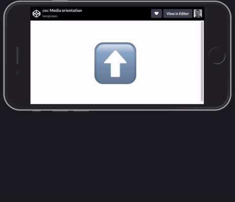
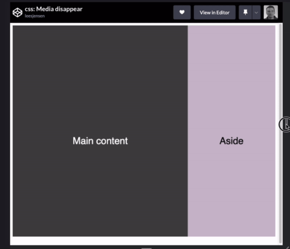

# Responsive design

**Suggested reading**: [MDN Responsive design](https://developer.mozilla.org/en-US/docs/Learn/CSS/CSS_layout/Responsive_Design)

Modern web applications are expected to run well on a large variety of computing devices. This includes everything from desktops, to mobile phones, to shopping kiosks, to car dashboards. This ability to reconfigure the interface so the application accommodates and takes advantage of the screen size and its orientation is called `responsive design`.

Much of HTML and CSS is already fluid due to the fact that it responds to the browser window being resized, but the following features help to completely reconfigure the application when the situation requires it.

## Media queries

One of the main CSS features that help us create responsive applications is the `@media` selector. This selector dynamically detects the size and orientation of the device and applies the appropriate CSS rules to represent the structure of the HTML in a way that accommodates the change.

We can use the `@media` selector to tell us which side of the screen (technically the viewport) is the longest. A media query takes one or more predicates separated by boolean operators. In our case we simply want to know if the screen is oriented in portrait mode (short side on top) or not.

```css
@media (orientation: portrait) {
  div {
    transform: rotate(270deg);
  }
}
```

Here is the result demonstrated by using the browsers debugger and switching into phone and then responsive mode. You can also view the [CodePen](https://codepen.io/leesjensen/pen/rNKZOva).



You can also use media queries to make entire pieces of your application disappear. For example, if we had an aside that was helpful when the screen is wide, but need to disappear when the screen got narrow we could use the following media query.

```css
@media (orientation: portrait) {
  aside {
    display: none;
  }
}
```



## Grid

## Flexbox

## Viewport metadata
