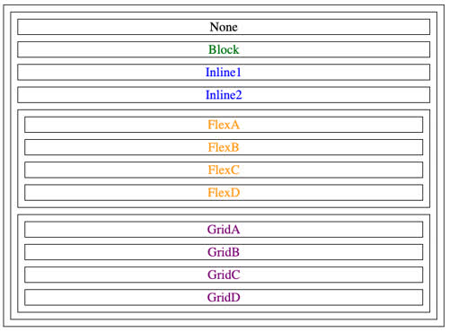
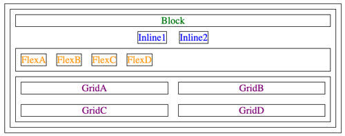
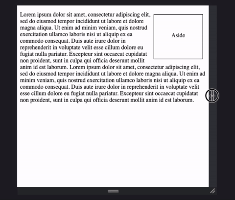

# Responsive design

📖 **Suggested reading**: [MDN Responsive design](https://developer.mozilla.org/en-US/docs/Learn/CSS/CSS_layout/Responsive_Design)

Modern web applications are expected to run well on a large variety of computing devices. This includes everything from desktops, to mobile phones, to shopping kiosks, to car dashboards. This ability to reconfigure the interface so the application accommodates and takes advantage of the screen's size and orientation is called `responsive design`.

Much of HTML and CSS is already fluid due to the fact that it responds to the browser window being resized. For example a paragraph element will resize when the browser window is resized. However, the following features can completely change the layout of the application based on the device's size and orientation.

## Display

📖 **Suggested reading**: [MDN Display](https://developer.mozilla.org/en-US/docs/Web/CSS/display)

The CSS display property allows you to change how an HTML element is displayed by the browser. The common options for the display property include the following.

| Value  | Meaning                                                                                                                      |
| ------ | ---------------------------------------------------------------------------------------------------------------------------- |
| none   | Don't display this element. The element still exists, but the browser will not render it.                                    |
| block  | Display this element with a width that fills its parent element. A `p` or `div` element have block display by default.       |
| inline | Display this element with a width that is only as big as its content. A `b` or `span` element have block display by default. |
| flex   | Display this element's children in a flexible orientation.                                                                   |
| grid   | Display this element's children in a grid orientation.                                                                       |

We can demonstrate the different CSS display property values with the following HTML that contains a bunch of `div` elements. By default `div` elements have a display property value of `block`.

```html
<div class="none">None</div>
<div class="block">Block</div>
<div class="inline">Inline1</div>
<div class="inline">Inline2</div>
<div class="flex">
  <div>FlexA</div>
  <div>FlexB</div>
  <div>FlexC</div>
  <div>FlexD</div>
</div>
<div class="grid">
  <div>GridA</div>
  <div>GridB</div>
  <div>GridC</div>
  <div>GridD</div>
</div>
```

With the default of `block` this HTML would render like this.



If we modify the display property associated with each element with the following CSS, then we get a totally different rendering.

```css
.none {
  display: none;
}

.block {
  display: block;
}

.inline {
  display: inline;
}

.flex {
  display: flex;
  flex-direction: row;
}

.grid {
  display: grid;
  grid-template-columns: 1fr 1fr;
}
```



You can experiment with different display property values with this [CodePen](https://codepen.io/leesjensen/pen/RwBOPjv).

## Viewport meta tag

When smart mobile devices started gaining popularity they began to be used to view websites. However, the websites were optimized for desktop displays and not little tiny mobile screens. To solve this mobile browsers automatically started scaling the website so that it looked better on a small screen. Unfortunately, as web applications started being responsive to the screen size, the mobile browser's scaling got in the way. The solution is to include a meta tag in the `head` element of all your HTML pages. This tells the browser to not scale the page.

```html
<meta name="viewport" content="width=device-width,initial-scale=1" />
```

## Float

The float css property moves an element to the left or right of its container element and allows inline elements to wrap around it. For example, if we had an `aside` element followed by a large paragraph of text, we could create the following CSS rule in order to cause the text to wrap around the aside.

```css
aside {
  float: right;
  padding: 3em;
  margin: 0.5em;
  border: black solid thin;
}
```



When the browser resizes, the text will flow around the floating element. You can use this [CodePen](https://codepen.io/leesjensen/pen/MWBRWPP) to experiment with `float`. Try changing the descriptor value to `none` or `left` and see what happens.

## Media queries

One of the main CSS features for creating responsive applications is the `@media` selector. This selector dynamically detects the size and orientation of the device and applies CSS rules to represent the structure of the HTML in a way that accommodates the change.

We can use the `@media` selector to tell us which side of the screen (technically the viewport) is the longest. A media query takes one or more predicates separated by boolean operators. In our case we simply want to know if the screen is oriented in portrait mode (short side on top) or not. If it is then we transform all of our div elements by rotating them 270 degrees.

```css
@media (orientation: portrait) {
  div {
    transform: rotate(270deg);
  }
}
```

We can demonstrate the result of applying the media selector by using the browser's debugger and switching into phone and responsive mode. You can also use this [CodePen](https://codepen.io/leesjensen/pen/rNKZOva) and play with it yourself by simply resizing the browser's window.


You can also use media queries to make entire pieces of your application disappear, or move to a different location. For example, if we had an aside that was helpful when the screen is wide, but took up too much room when the screen got narrow, we could use the following media query to make it disappear.

```css
@media (orientation: portrait) {
  aside {
    display: none;
  }
}
```


Here is the [CodePen](https://codepen.io/leesjensen/pen/NWzLGmJ) for this example.

## Grid and Flexbox

The final two responsive technologies that we want to discuss are Grid and Flexbox. These are both CSS display modes that automatically respond to screen sizes to position and resize their child elements. We will discuss each of these in detail in the following instruction.
