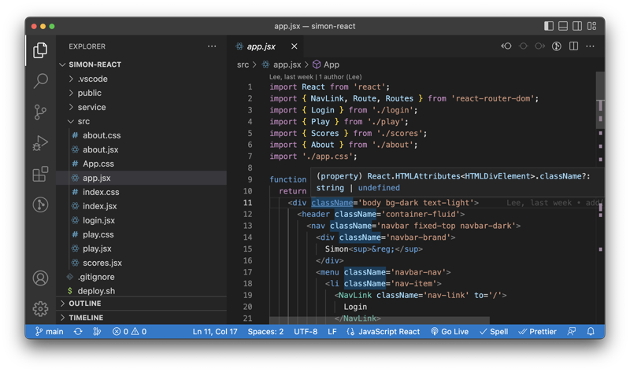
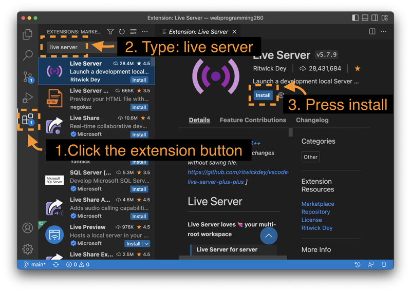

# Editors

The code editor is the workspace of a web application developer. Deeply learning an editor that makes you efficient and flexible will pay significant dividends in your ability to deliver quality work and greatly reduce frustration. A good editor should feel like a friend. If you are constantly arguing with your editor, then perhaps you need a relationship adjustment.

For your work with this instruction I would highly suggest you use two editors. The first one, Visual Studio Code, is your main workhorse for your daily coding activities. The second one, is VI. You will use VI when you are shelled into your production environment and need a simple, but powerful, console based editor for quickly editing text files.

## Visual Studio Code

**Website**: [VSCode](https://code.visualstudio.com/)

Created by Microsoft, Visual Studio Code (VSCode), is free and supported by a large community of open source developers. The [2021 Stack Overflow](https://insights.stackoverflow.com/survey/2021#section-most-popular-technologies-integrated-development-environment) developer survey put VSCode as the number one choice for 71% of professional developers.

VSCode is both simple to use and incredibly flexible and powerful. At its most basic level it represents files in a given directory on the left and an editor space for those files on the right. VSCode then adds excellent git support, auto-formatting, auto-suggestions, and debugging support for JavaScript right out of the box. You can then easily install a language server extension most major programming languages that provide coding, building, and debugging support. From there you have your choice of thousands of extensions to add whatever functionality you would like. This includes extensions such as an auto-reloading HTTP server for hosting your project code locally, an image editor, a spell checker, hex editor, testing frameworks, linters, code prettier, or even docker container management to compartmentalize your development of different projects.

So unless you are already a master of some other development environment, it is highly suggested you go and [install VSCode right now](https://code.visualstudio.com/).

### Live Server extension

This is one extension that is great for building web applications. You are going to build a lot of HTML, CSS, and JavaScript. You can do much of this on CodePen, but for your projects your are going to be working in your development environment. This means you will have a GitHub repository cloned to your personal development computer. When you open VSCode to the directory where your repository is located you can start creating HTML, CSS, and JavaScript, but when you want to see what it is going to actually do when it is served up by a web server you need to actually run a web server to deliver your files to the browser. That is where the Live Server extension comes in handy. With the press of the `Go Live` button on the bottom right status bar, your entire project directory is served up through your browser. Additionally, if you make any changes to a file the browser will automatically be updated.

To install the Live Server extension, open up VSCode and follow these three simple steps.

## GitLens

The basic support the VSCode offers for working with `git` is sufficient for most tasks, but if you really want to unleash the power of git, consider installing the `GitLens` extension. It makes reviewing the commit history, stashing, merging, and comparing so much easier. With over 18 million users, you might enjoy joining the party.

## VI
