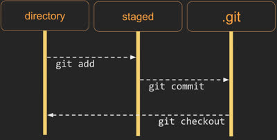
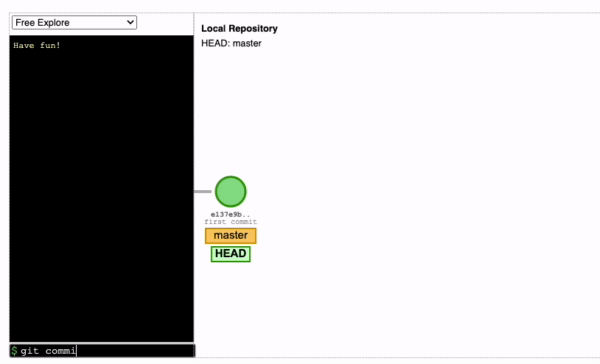

# Git


[Linus Torvalds](https://en.wikipedia.org/wiki/Linus_Torvalds), the creator of Linux, was fed up with the proprietary version control software that he was using to track the code for the Linux kernel and so over a weekend he built Git, the world's most popular version control system.


> “Talk is cheap. Show me the code.”
>
> — Linus Torvalds

## Installing Git

Before we can talk about Git you need to make sure it is installed in your development environment. Open a console and type `git --version`.

```sh
➜  git --version
git version 2.32.0 (Apple Git-132)
```

If you do not see something like that, then you need to follow these [instructions](https://git-scm.com/book/en/v2/Getting-Started-Installing-Git) to install Git.

## What is Git?

Git provides two valuable functions. First, it allows you to track versions of files in a directory. Second, it allows you to clone all of those versions to a different location, usually to a different computer. We are going to focus on tracking versions in this instruction and cover cloning repositories when we talk later about GitHub.

You can track file versions of any files in a directory by initializing Git for that directory. You can do this right now by creating a new directory in a console window and initializing it as a Git repository.

```sh
➜  mkdir playingWithGit
➜  cd playingWithGit
➜  git init
```

If you list all files in the directory you will see that you now have a hidden directory named `.git`.

```sh
➜  ls -la
total 0
drwxr-xr-x   3 lee  staff    96 Dec  1 22:59 .
drwxr-xr-x+ 54 lee  staff  1728 Dec  1 23:00 ..
drwxr-xr-x   9 lee  staff   288 Dec  1 22:59 .git
```

The `.git` directory is where all of the versions get stored. Now use the `echo` command to create a file so that we can see how versioning works. After creating the new file, use `git status` to tell you what git is doing.

```sh
➜ echo hello world > hello.txt
➜ git status

On branch master
No commits yet
Untracked files:
  (use "git add <file>..." to include in what will be committed)
 hello.txt

nothing added to commit but untracked files present (use "git add" to track)
```

`git status` tells you that it detects a new file named `hello.txt`, but it isn't currently tracking versions for that file. To begin tracking versions you need to add it. Usually you track all files in a repository directory and so you can tell Git to track everything that it doesn't know about with `git add .` (don't forget the period). Follow this with another call to `git status`.

```sh
➜  git add .
➜  git status

On branch master
No commits yet
Changes to be committed:
  (use "git rm --cached <file>..." to unstage)
 new file:   hello.txt
```

Now Git tells us that it has _staged_ the file `hello.txt`, meaning it is ready to be committed as a version in the repository. We commit a version with the `commit` command. We always want to have a meaningful comment about the version we are committing and so we use the `-m` parameter to provide a message that will live with the version. Follow this with another call to `git status`.

```sh
➜  git commit -m "initial draft"
[master (root-commit) d43b07b] initial draft
 1 file changed, 1 insertion(+)
 create mode 100644 hello.txt

➜  git status
On branch master
nothing to commit, working tree clean
```

Congratulations! You have just committed your first file to a Git repository. It is important to note that we were only working with a single file in this example. However, a commit can represent multiple files. You just need to add them all before you execute the commit. Also, note that the point of the stage (`git add`) step, is so that you can commit some files while still leaving other modified files out of the commit. Only files you've staged will be committed.

Let's make an edit to our file and commit it again. This time we will tell Git that we want to add all the tracked modified files to our commit (without having to `git add` them again) by including the `-a` parameter along with our message parameter.

```sh
➜  echo goodbye world > hello.txt

➜  git commit -am "changed greeting to reflect the present mood"

[master e65f983] changed greeting to reflect the present mood
 1 file changed, 1 insertion(+), 1 deletion(-)
```

Now that we have a couple versions in our repository we can view the versions with the `git log` command.

```sh
➜  git log

commit e65f9833ca8ee366d0d9c1676a91b1a977dab441 (HEAD -> master)
Author: Lee
Date:   Thu Dec 1 23:32:22 2022 -0700

    changed greeting to reflect the present mood

commit d43b07b8890f52defb31507211ba78785bf6dccf
Author: Lee
Date:   Thu Dec 1 23:29:11 2022 -0700

    initial draft
```

This shows both commits with the associated comments.

## Commit SHA

Every commit has a unique identifier that is generated by hashing the file along with the timestamp using the SHA hashing algorithm. You can always refer to a specific commit in your version history by using its SHA. For example, if we want to temporarily switch back to a previous version to see what it contains we can use the `checkout` command. You only need to provide the first few characters of the SHA.

```sh
➜  git checkout d43b07b8890f

Note: switching to 'd43b07b8890f'.
HEAD is now at d43b07b initial draft

➜  cat hello.txt
hello world
```

The above output omits a big message saying that you are no longer looking at the latest version, but the important thing is that you can see that we are now looking at our old version. (Careful: commits made here can do funky things.) To get back to the top of the version chain, use the `checkout` command and reference the branch name, which is by default `master`.

```sh
➜  git checkout master
Previous HEAD position was d43b07b initial draft
Switched to branch 'master'

➜  cat hello.txt
goodbye world
```

Now we are back to our latest version.

The following diagram shows how your commits move from your working directory, to staging them for a commit, and then committing them to a repository.



A commit is a full snapshot of what was staged from your directory at the time of the commit. That means all of the files contained in the commit were reverted when you executed the checkout command. Since we only had one file in our commit, it looks like we are only flipping that file around, but basically you can think of it as a time machine for the entire directory.

## Diff

Most of the time you don't want to reverse back to an earlier commit. Instead you just want to compare the differences between commits. We can do that with the `diff` command. You can specify two SHAs that you would like to compare, or you can use the `HEAD` variable, which always points to the commit you're currently looking at. To refer to earlier commits you just add `~` and the numerical distance from `HEAD` that you want to reference. In this case we will compare `HEAD` and `HEAD~1`.

```sh
➜  git diff HEAD HEAD~1
```

```diff
diff --git a/hello.txt b/hello.txt
index 3b18e51..eeee2af 100644
--- a/hello.txt
+++ b/hello.txt
@@ -1 +1 @@
-hello world
+goodbye world
```

You can see that we made a change to `hello.txt` by removing `hello world` and adding `goodbye world`.

## Branches

Git supports the ability to branch your code. This allows you to work on variations of the code while still allowing progress on the main branch. For example, if you wanted to work on a new feature named `A` without interrupting work on the master branch, you would use the `git branch A` command to create a new branch named `A`, then start working on the new branch with the `git checkout A` command. Now commits can be done to either the `master` branch or the `A` branch. When you want to combine the work done on both branches, you checkout the `master` branch and execute `git merge A`. If you decide you want to abandon the new feature, then you just don't ever merge it back into the master branch.

Here is a demonstration of this working on the visualization tool provided by [git-school.github.io](https://git-school.github.io/visualizing-git/).



## Commit often

You will be required to have at least 4 commits for each project that you submit in order to get full credit. Commonly, this will be an initial commit that contains empty project files, followed by commits at each functional milestone, and then a final commit for the working project. Committing your code often is an important practice for you to develop. It protects you from losing your work, allows access from anywhere, makes it so you can quickly share changes, reduces conflicts with your peers, and enables you to efficiently explore different possibilities. This also enables others to review the progression of your development efforts in order to prove the originality of your work.

Remember to make meaningful commit messages that describe the **what** and **why** of the changes made. Here is a [good post](https://www.freecodecamp.org/news/how-to-write-better-git-commit-messages/) on how to make meaningful commit messages.

## Binary files

You can store any type of file in Git, but be aware that if you store large binary files, such as images or videos, you are storing a copy of that file each time you make a change to it. For example, suppose you use Git to track the changes you make to a video production project. Every time you save a change to your 10 GB video file you store a complete copy of the file. That means 10 commits of the video file will store 100 GB of data in your repository.

## VS Code and Git

Knowing how to use Git from the console is a very valuable skill. Git offers a wide variety of functionality such as creating branches of the repository, temporarily stashing changes, and cloning repositories to other machines.

However, by using a tool like VS Code you can hide all of the complexity of the command line and use a visual interface instead.

Here we see VS Code, with the GitLens extension installed, looking at the directory we have been working in. On the left you see all the commits we have previously created. We can edit our `hello.txt` file and VS Code will automatically detect the change and set it up for us to commit. VS Code will even put a marking on the left side of the edited text to show us what line we have changed. We can click on the staged file, in the commit area, and see the differences before we commit. Since they look good, we add a comment, and press commit. The new commit immediately shows up in our list of commits. We can use the visual diff again to click through all of the previous versions.


Underneath the covers, the GitLens extension is running Git commands just like we did on the command line, but using a visual tool makes working with versions much easier. Take some time and play with adding files, modifying them, committing, and diffing. You want to get to the point where this is second nature so that you can easily experiment and make mistakes, knowing that with Git, you can always easily recover.
