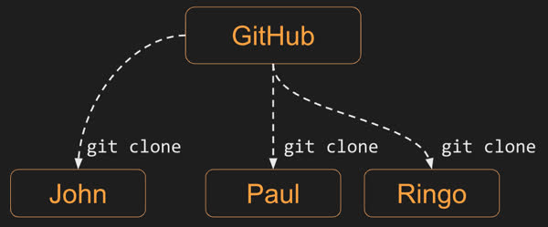
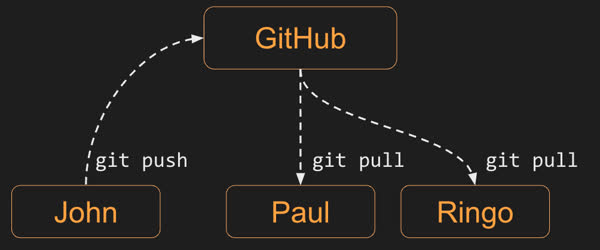
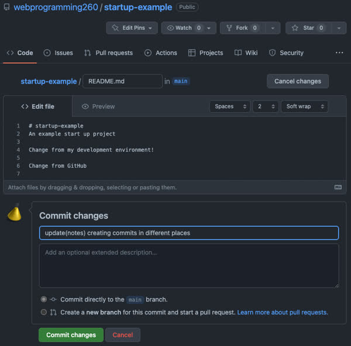

# GitHub


📖 **Required reading**:

- [GitHub create a repo](https://docs.github.com/en/get-started/quickstart/create-a-repo)
- [GitHub cloning a repo](https://docs.github.com/en/repositories/creating-and-managing-repositories/cloning-a-repository)
- [GitHub personal access tokens](https://docs.github.com/en/authentication/keeping-your-account-and-data-secure/creating-a-personal-access-token)

When we introduced `Git`, we said that Git provides two things, 1) Version tracking in a repository, and 2) the ability to clone a copy of the repository to a different location. You can clone repositories between computers used by your development team, but the management of cloning repositories is much easier when you use a cloud based service such as `GitHub`.

GitHub was launched in 2008 by a small group of developers that wanted to make code collaboration easy. GitHub was acquired by Microsoft in 2018 for $7.5 billion. Since its beginning as a simple web application for cloning and storing Git repositories, GitHub has added functionality for hosting websites, supporting community pull requests, tracking issues, hosting codespaces, running continuous deployment processes, managing projects, and even AI driven code generation.

We are going to use GitHub for three things.

1. Hosting all of this instruction. Because it is hosted on GitHub you can generate pull requests when you see things that need improvement.
1. Publicly hosting your project repositories. This creates a backup copy of your code, demonstrates your progress with your commit history, allows for reviews of your code, and makes it so you can collaborate with your peers.
1. Keeping notes about what you have learned and things you want to remember.

## Creating a GitHub account

If you do not already have a GitHub account then go and [create one now](https://github.com). GitHub provides a free version of their services that will more than cover your usage in this class. Chances are that once you start using GitHub you will use this account for many years to come, both for personal and professional projects.

## Creating and cloning a repository

While you can create a repository in your development environment using `git init` and then connect it to an upstream repository on GitHub, it is always easier to create your repository first on GitHub and then clone it to your development environment. That way your repositories are automatically linked to each other.

To create a repository in GitHub, log into your account, select the `Repositories` tab, and press `New repository`. You then specify a unique repository name, give a description, indicate that you want it to be public, add a default README.md file, and choose a license.


Every repository in GitHub has a unique URL assigned to it. Assuming the repository is public, anyone with the URL can clone it to their development environment. A repository clone is an exact copy of the repository including all of the commits, comments, and SHAs. It also configures the clone to know what the remote source is so that you can use Git commands to keep them in sync as changes are made.



You clone a repository by providing the GitHub repository's URL as a parameter to the `git clone` command from in a console window. You can get a copy of the URL from the repository's GitHub page and clicking on the green `Code` button, and then clicking on the copy button next to the HTTPS url.


When you clone a repository it is placed in a subdirectory named with the name of the repository. So make sure you are in the directory where you keep all of your source repositories before you run the command.

```sh
➜  git clone https://github.com/webprogramming260/startup-example.git

Cloning into 'startup-example'...
remote: Total 4 (delta 0), reused 0 (delta 0), pack-reused 0
Receiving objects: 100% (4/4), done.

➜  cd startup-example
```

## Making changes

You can now make changes to the files in the repository and commit those changes. As you create new commits you want to push those changes back up to the GitHub clone of the repository so that the repositories are are in sync with each other. This is done with the `push` Git command. Once you have pushed the new commits then your peers who have cloned the repository can pull the commits down using the `pull` Git command.



The following demonstrates console commands for making a change to the README.md file, committing it, and then pushing it up to GitHub. Of course you can also do this using the Git interface of VS Code.

```sh
➜  printf "\nChange from my development environment!\n" >> README.md

➜  git commit -am "update(notes) thoughts about start up applications"

➜  git push
```

This is the pattern that you want to make a reflexive part of your development process.

1. Pull the repository's latest changes from GitHub (`git pull`)
1. Make changes to the code
1. Commit the changes (`git commit`)
1. Push the changes to GitHub (`git push`)

⚠ Note: The first time you make a push request to a repository Git will ask you how you want to identify yourself and what credential (e.g. password) to use in order to authenticate with GitHub. You will need to create a [Personal Access Token](https://docs.github.com/en/authentication/keeping-your-account-and-data-secure/creating-a-personal-access-token) and provide that as your password.

After pushing changes GitHub, you then view the changes on GitHub with your browser. In the example above, you would see the changes to the `README.md` file. You can also edit and commit changes directly from GitHub. When looking at a repository file on GitHub you will see a little pencil in the top right hand corner of the file. If you press that you will enter edit mode. You use that to modify the file and then commit the changes with an appropriate comment.



Now that there is a commit that GitHub has that you do not have in your development environment. If we run the `fetch` Git command, you will get the latest information about the changes on GitHub without actually changing your local repository. We then run the `status` Git command to see the differences between the clones and see that we are missing a commit. You can pull it down using the `pull` Git command. You can also use the Git functionality in VS Code to view the status and sync up your repository.

```sh
➜  git fetch
➜  git status
Your branch is behind 'origin/main' by 1 commit, and can be fast-forwarded.
  (use "git pull" to update your local branch)

➜  git pull
Updating d13a9ce..cafe81a
Fast-forward
 README.md | 4 +++-
 1 file changed, 3 insertions(+), 1 deletion(-)
```

After running the pull command, your development clone and the GitHub clone are now the same.

## Handling merge conflicts

By pushing and pulling often, everyone keeps an up to date copy of the repository. This is important so that you don't run into merging problems caused by two peers modifying the exact same code. Merging only becomes something you have to deal with when two people modify the exact same line of code. However, when you have two peers working together you are always going to have a merge conflict at some point in time and so let's discuss how to handle this.

We can simulate a merge conflict by editing a line in a file and committing the file in your development environment, and before pushing that change, modifying the same line using GitHub. Now, run `fetch` and `status` again in your console.

```sh
➜  git fetch
➜  git status
Your branch and 'origin/main' have diverged,
and have 1 and 1 different commits each, respectively.
  (use "git pull" to merge the remote branch into yours)
```

This shows that the cloned repositories have diverged from each other. Normally this is fine and we can just push and pull the different commits, but if we do that this time we will get an error because the exact same line was changed in the two different commits.

```sh
➜  git pull

Auto-merging README.md
CONFLICT (content): Merge conflict in README.md
Automatic merge failed; fix conflicts and then commit the result.
```

We now need to resolve the merge conflict that it says has happened with our `README.md` file. If you are using VS Code with the GitLens extension installed it will visually walk you through this process. However, so you can understand what is going on, we will do this using the console. The first step is to open up `README.md` in an editor. You will see that git has injected lines that highlight where the conflict is. Both your local change and the change made on GitHub are included.

```diff
An example start up application

Change from my development environment!

Change from GitHub

<<<<<<< HEAD
Conflict change made in development environment
=======
Conflict change made in GitHub
>>>>>>> b9f4c53c91eff509993d7291e60148f903827de0
```

We resolve the conflict by modifying the file to remove the textual conflict delimiters and modifying the file to keep the changes we want. When we are done editing, our file contains what we want from both commits.

```md
# startup-example

An example start up application

Change from my development environment and from GitHub
```

Now that the conflict is resolved we commit our resolution and push up the result.

```sh
➜  git commit -am "merge(notes) combined both edits"
➜  git push
```

If you go look at the file again on GitHub you will see the additional commit in the history and the result of our merge in the file content.

## Keeping notes

Keeping notes of what you have learned and things that you want to remember is an essential step for accelerating your web programming skills. GitHub supports the inclusion of a file with the special name `README.md` in the root of your repository. This file uses `Markdown` syntax. If you have not used Markdown before, then take some time to [learn how to use it](https://docs.github.com/en/get-started/writing-on-github/getting-started-with-writing-and-formatting-on-github/basic-writing-and-formatting-syntax). For this course you will use your start up application's README.md file and your website's README.md to keep notes.

## Pull requests

GitHub allows you to create a fork of any repository on GitHub. You just push the `fork` button from the repository's GitHub page. This will copy the repository to your GitHub account. This is similar to cloning a repository to your development environment, but it clones to GitHub instead. You can then make modifications to the repository and push the changes as a pull request. This notifies the original repository's owner that a request is being made to enhance the original repository. The owner can review your changes and if appropriate commit the changes into the original. This is how open source communities manage development from a volunteer group of global developers.

In this class, if you notice something in the instruction that needs to be enhanced, feel free to fork the repo, and make a pull request. This will give you experience with this practice and improve the instruction for others at the same time. Plus your name will be include as a contributor. How cool is that!

# ☑ Assignment

Do the following steps to set up your `Start up application repository` in GitHub and clone it to your development environment.

1. Create a GitHub account if you do not already have one.
1. Create a repository, named `startup`, for your start up application. Your project must be public. Select the option for a default README.md file. This is where you will also keep all of your notes for things that you learn and want to remember.
1. Clone the repository to your development environment, by getting the repository's URL, and using `git clone`.
1. Open up the repository directory in VS Code and modify the README.md file.
1. Use the Git functionality of VS Code to commit your changes and push them to GitHub.
1. In GitHub modify your README.md file and commit the changes.
1. In VS Code pull down and review the changes.
1. Make another change to the README.md file on GitHub and commit the change.
1. Before you pull the changes to your development environment, change the same line in the README.md file and commit the change.
1. Attempt to pull the GitHub changes to your development environment. Note and resolve the merge conflict. Commit the merged changes. Push the merge commit.
1. On GitHub observe the resolved merge.
1. Make your first notes in your README.md file about what you learned from this assignment. Commit and push your notes to GitHub.

When you are done, provide the URL of your GitHub start up repository, along with a comment about something you found interesting, to the Canvas assignment.
