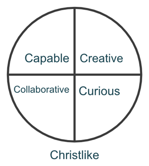

# Introduction to web programming

Web programming skills are among the most valuable ones that you can learn within the field of computer science. With web programming you can construct applications that are accessible on phones, tablets, desktops, kiosks, car dashboards, and even refrigerators. You can provide data and services to the entire planet. Every business and industry needs what web programming provides. Taking the time to acquire these skills, no matter what career you eventually pursue, will open doors to you that otherwise would be inaccessible.

Web programming skills also evolve very quickly. There are some fundamental concepts that serve as a foundation for understanding, but the details of building modern web applications change constantly. For that reason, you should approach the subject of web programming, not to learn a specific technology, because that will already be out of date by the time you finish this instruction, but to learn how to learn web programming.

## Learning philosophy

The key to learning how to be an exceptional web programmer rests in you ability to continually improve in four areas.

1. **`Technology`** - You need to know the technology. The better you know it the better you will be able to leverage its abilities and apply it correctly. Knowing who the experts are, and discerning between meaningful technology and fads, driven by marketeers, allows you quickly find the valuable and avoid the distractions. Knowing technology will enable you to find the right tool for the job, maximize its performance, and automate its execution.
1. **`Art`** - Making a visually attractive web application requires artistic skills. However, there is just as much art in making them usable, efficient, and maintainable. Knowing how to organize and sculpt your code is incredibly artistic. Well designed systems are often referred to as beautiful or elegant, and a reflection of the creativity of their authors.
1. **`Social`** - Web applications are rarely created and used by one person. Usually you build an application for a large group of customers, and they almost always are created by a team of contributors with different backgrounds and roles. The ability for that team to work together and interact with customers is essential. These are social skills. The more skilled you are at talking, writing, reading, presenting, expressing body language, projecting a good appearance, and most importantly, listening, the more successful you will be.
1. **`Discovery`** - Having a mind that is always questioning will make all the difference. Simply doing the job is not enough. Wanting to know why the job is useful, searching for alternative directions, digging into the inner workings of a black box, and questioning accepted facts are all where advances come from. Cultivating a love for life long learning will take you from adequate to exceptional.

A [2022 interview](https://appleinsider.com/articles/22/10/03/if-you-want-to-work-for-apple-you-need-these-four-traits) with the CEO of Apple, Tim Cook, echoed the value of these four abilities.

> When hiring we look for the ability to collaborate, creativity, curiosity, and expertise

## Making mistakes

Making mistakes is a key component for learning. Recognizing and embracing the power of making mistakes will help you learn faster, and at a deeper level. Just decide that you are going to make mistakes and that is fine, even preferable. Many of the most important discoveries of all time were a result of making and understanding mistakes. No one learns to walk without falling down. With that said, you should acquire a framework where you can make mistakes while minimizing their ability to slow your progress. Things such as version repositories, notebooks, simulations, working with peers, automation, and reproducibility are all useful for safely making mistakes.

Whenever you approach something new, approach it with the attitude that you will learn by making mistakes.

## Welcome to start up 260!

The class should have the energy of a start up. We are on the cutting edge of technology. We are building applications to change the world. We even have no funding and will work long hours. Sounds like a start up to me. I will do my best to bring all my energy to our time together, and hope you will do likewise. Together, as a team, we are going to have a lot of fun.
