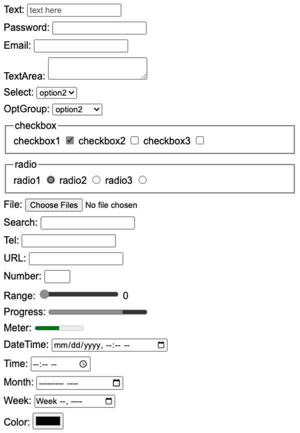

# HTML input elements

📖 **Suggested reading**: [MDN Input element](https://developer.mozilla.org/en-US/docs/Web/HTML/Element/input)

From the very early days of HTML it contained elements for accepting the input of user data. These elements include the following:

| Element    | Meaning                          | Example                                        |
| ---------- | -------------------------------- | ---------------------------------------------- |
| `form`     | Input container and submission   | `<form action="form.html" method="post">`      |
| `fieldset` | Labeled input grouping           | `<fieldset> ... </fieldset>`                   |
| `input`    | Multiple types of user input     | `<input type="" />`                            |
| `select`   | Selection dropdown               | `<select><option>1</option></select>`          |
| `optgroup` | Grouped selection dropdown       | `<optgroup><option>1</option></optgroup>`      |
| `option`   | Selection option                 | `<option selected>option2</option>`            |
| `textarea` | Multiline text input             | `<textarea></textarea>`                        |
| `label`    | Individual input label           | `<label for="range">Range: </label>`           |
| `output`   | Output of input                  | `<output for="range">0</output>`               |
| `meter`    | Display value with a known range | `<meter min="0" max="100" value="50"></meter>` |

## Form element

The main purpose of the `form` element is to submit the values of the inputs it contains. Before JavaScript was introduced the `form` container element was essential because it was the only way for the browser to send the input data to a web server as part of a request process the input and generate a new web page displaying the result of the input. With JavaScript we have much more control over input data and what is done with it. For example, in a single page application the JavaScript will dynamically rebuild the HTML elements to reflect the results of the user interaction. With this ability the data may not even be sent to the server. This greatly reduces the necessity of the `form` element, but it is often still used simply as a container. Just remember that you are not required to have a form element to use input elements.

Here is an example of a simple form that submits the value of a `textarea` element.

```html
<form action="submission.html" method="post">
  <label for="ta">TextArea: </label>
  <textarea id="ta" name="ta-id">
Some text
  </textarea>
  <button type="submit">Submit</button>
</form>
```

Pressing the submit button sends the following data to the web server. The browser generates the data by combining the textarea's `name` attribute with the current value of the textarea.

```
ta-id=Some+text
```

## Input element

The input element represents many different input types. You set the type of input with the `type` attribute. There are many different types to choose from. This includes different flavors of textual, numeric, date, and color inputs.

| Type           | Meaning                           |
| -------------- | --------------------------------- |
| text           | Single line textual value         |
| password       | Obscured password                 |
| email          | Email address                     |
| tel            | Telephone number                  |
| url            | URL address                       |
| number         | Numerical value                   |
| checkbox       | Inclusive selection               |
| radio          | Exclusive selection               |
| range          | Range limited number              |
| date           | Year, month, day                  |
| datetime-local | Date and time                     |
| month          | Year, month                       |
| week           | Week of year                      |
| color          | Color                             |
| file           | Local file                        |
| submit         | button to trigger form submission |

In order to create an input you specify the desired `type` attribute along with any other attribute associated with the input. Here is an example of a checked radio button and its associated label.

```html
<label for="checkbox1">Check me</label>
<input type="checkbox" name="varCheckbox" value="checkbox1" checked />
```

Most input elements share some common attributes. These include the following.

| Attribute | Meaning                                                                             |
| --------- | ----------------------------------------------------------------------------------- |
| name      | The name of the input. This is submitted as the name of the input if used in a form |
| disabled  | Disables the ability for the user to interact with the input                        |
| value     | The initial value of the input                                                      |
| required  | Signifies that a value is required in order to be valid                             |

The following shows what the inputs look like when rendered. Don't worry about how clunky they look right out of the box. We will fix that when we start styling things with CSS.



## Validating input

Several of the input elements have validation built into them. This means that they will not accept a value that is not for example, a number, in a defined numerical range, a URL, or an email address. You can also specify the `required` attribute on an input element to mark it as requiring a value before it can be submitted. The `pattern` attribute exists on `text`, `search`, `url`, `tel`, `email`, and `password` inputs. When present it provides regular express that must match for the input to be considered as valid.

You should also have validation built into your JavaScript that checks input data to ensures everything is valid before it is submitted. All of the input elements support functions for determining their validation state. Additionally, there are CSS style selectors for visualizing the validity of the input. In order to have a good user experience, it is critical that you provide sufficient user feedback early in the input process. A good design will give feedback as, or before, the user begins to input. A poor design will keep the user guessing as to why the data is not being accepted, or even if it was accepted.

## ☑ Assignment

This [CodePen](https://codepen.io/leesjensen/pen/dyVdNej) demonstrates all of the major input elements. Fork the pen and experiment.

When you are done submit your CodePen URL, along with a description of something you found interesting, to the Canvas assignment.
