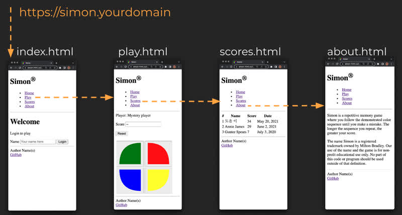

# Startup HTML

Now that you have learned the basics of HTML, is time to structure your startup application. This includes all of the pages, headers, footers, images, and content necessary to represent what your application will do. The application doesn't have to do anything, but there should be a placeholder for everything that you application will do.

You will want an HTML file for each of the main components of your application. The default component of your application **must** be represented in a file named `index.html` since that is the file a browser will load by default. Here is what the Simon example pages look like.



You will want a similar layout. Make sure you have a placeholder for all the technologies that you will eventually need to represent in your application. This includes:

- **Application data**: A rendering of application data that you will eventually populate. For Simon, this is the simple SVG graphic buttons.
- **Authentication**: An input for your user to create an account and login. You will want to display the user's name after they login.
- **Database data**: A rendering of application data that is stored in the database. For Simon, this is the high scores of all players.
- **WebSocket data**: A rendering of data that is received from your server. This maybe realtime data sent from other user's (e.g. chat or scoring data), or realtime data that your service is generating (e.g. stock prices or latest high scores). For Simon, this represents every time another user creates or ends a game.

The following is a possible layout of the main pieces that your application should have. Note that you do not have to have four HTML pages. You should create the number of pages that makes sense for your application. This maybe only one, or it could be many.


At this point your application will look rather strange because it doesn't have any styling to make it look right. That is fine. You are just focusing on structure and content placeholders in this deliverable.

You must use the same startup GitHub repository that you created for the specification deliverable. Update the notes.md file with things that you learn as you work on your startup. As you make changes to your HTML commit those changes and push them to GitHub. You will need at least four commits to get full credit, but in reality you should have many more than that.

Remember to use the `Live Server VS Code extension` to see what your code looks like in the browser. Also use the browser's debugger window to debug your HTML.

Once you have developed your application to where you want it, you need to release it to your production environment. **Copy** the `deployFiles.sh` script from the [Simon HTML repository](https://github.com/webprogramming260/simon-html/blob/main/deployFiles.sh) to your startup repository and use `startup` for the service parameter (`-s`)

```sh
./deployFiles.sh -k <yourpemkey> -h <yourdomain> -s startup
```

For example,

```sh
./deployFiles.sh -k ~/keys/production.pem -h yourdomain.click -s startup
```

Doing this will make this deliverable of your startup available from `https://startup.yourdomainname`.

## ☑ Assignment

1. Review and deploy Simon HTML
   1. Clone the HTML Simon repository to your development environment.
   1. Open the project in VS Code and examine the application's use of HTML.
   1. Execute in your development environment using the VS Code Live Server extension.
   1. Debug using the browser's dev tools to examine the loading of the HTML on the Network tab, and the HTML in the Elements tab.
   1. Deploy to your production environment using the deployment script so that it is available with your domain's `simon` subdomain.
1. Create the HTML deliverable of your startup application. Make sure your name is displayed in the application and that there is a link to your GitHub repository.
1. Represent all of the content and structure that your final application will need.
1. Include placeholders for all of the technology that your application will eventually represent.
1. Make sure your main HTML file is named `index.html` so that it will load by default.
1. Periodically commit and push your code to GitHub.
1. Periodically update your startup repository's notes.md file to reflect what you have learned and want to remember.
1. Push your final version of your project to GitHub.
1. Deploy your startup application to your production environment (your server).
1. Make sure your application is available from your production environment.
1. Upload the URL to your startup application to the Canvas assignment.

## Grading Rubric

- (Required) Simon HTML deployed to your production environment
- (Required) A link to your GitHub startup repository prominently display on your home page
- Properly structured HTML
  - 20% HTML pages for each component of your application
  - 10% Links between pages as necessary
  - 10% Application text content
  - 10% Application images
  - 10% Login placeholder, including user name display
  - 10% Database data placeholder showing content stored in the database
  - 10% WebSocket data placeholder showing where realtime communication will go
- 10% - Multiple Git commits with meaningful comments.
- 10% - Notes in your startup Git repository README.md file documenting what you modified and added with this deliverable. Also add notes in your notes.md file describing what you have learned using HTML.

## Go celebrate

You did it! This is a significant milestone. Time to grab some friends, show them what you did, and celebrate with soft serve 🍦.
