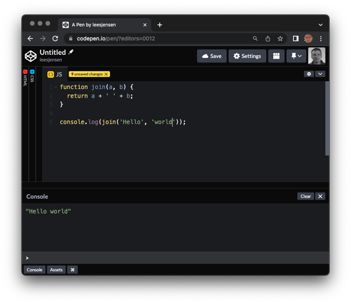
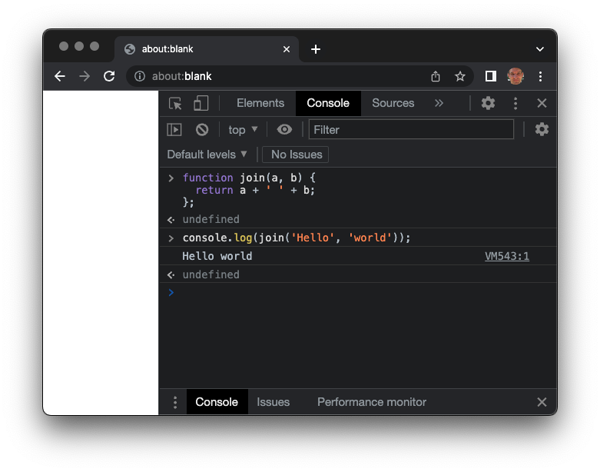

# JavaScript introduction


JavaScript is a weakly typed language based upon concepts found in C, Java, and Scheme. It is by far the most used programming language in the world. It runs on every web browser, is commonly used as a web server language, and for many serverless functions. In this instruction we will cover the basic parts of the language necessary to create a reasonable website. There are many features of the language that will not be discussed and you should take time to dig into the corners of the language as time allows. The more effectively you understand JavaScript the better web programmer you will be.

Typically JavaScript is executed using an interpreter at runtime instead of compiling it into a machine specific binary at build time. This has the advantage of making JavaScript very portable, but also allows for many errors, such as a reference to an undefined variable, to stop the execution of the JavaScript at runtime.

## JavaScript Versions

The following table describes the version history of JavaScript. You don't need to worry about versions right now, but this is important to be aware of since browser compatibility is always an issue when developing a web application. When considering the use of a JavaScript feature you should consult websites like [MDN](https://developer.mozilla.org/en-US/docs/Mozilla/Add-ons/WebExtensions/Browser_support_for_JavaScript_APIs) or [CanIUse](https://caniuse.com/) to see how well the feature is supported.

| Year | Version | Features                                                                                                                  |
| ---- | ------- | ------------------------------------------------------------------------------------------------------------------------- |
| 1997 | ES1     | types, functions                                                                                                          |
| 1999 | ES3     | regex, exceptions, switch                                                                                                 |
| 2009 | ES5     | json, array iteration                                                                                                     |
| 2015 | ES6     | let/const, default params, classes, template literals, destructuring, generators, promises, modules, internationalization |
| 2016 | ES2016  | array.includes                                                                                                            |
| 2017 | ES2017  | async/await                                                                                                               |
| 2018 | ES2018  | rest/spread, promise.finally                                                                                              |
| 2019 | ES2019  | string.trim                                                                                                               |
| 2020 | ES2020  | ?? operator                                                                                                               |

## Getting started

Let's start with a basic example. The following JavaScript will concatenate three strings together and then throw away the result. Not very useful, but JavaScript doesn't complain much.

```js
'Hello' + ' ' + 'world';
```

Only slightly more complex is to call a function with the result of our concatenated string. In this case we call the JavaScript runtime's built in function `console.log` to output the string to the debugger console.

```js
console.log('Hello' + ' ' + 'world');
// OUTPUT: Hello world
```

You can also write your own functions.

```js
function join(a, b) {
  return a + ' ' + b;
}

console.log(join('Hello', 'world'));
// OUTPUT: Hello world
```

## Comments

You can comment out JavaScript with either line or block comments.

```js
// Line comment

/*
Block comment
*/
```

## Code delimiters

While not technically required in most cases, it is considered good form to end JavaScript statements with a semicolon (`;`). Code blocks, and their resulting scope, are defined with curly braces (`{`, `}`).

## Playgrounds

Before we go any further we need a way for you to write and run JavaScript yourself. There are lots of ways to do this, but a few methods are commonly used. The following list, in increasing complexity, describes each method.

1. Use an online sandbox like [CodePen](https://codepen.io). With CodePen you can write whatever JavaScript you would like and immediately see the results. Make sure you display the CodePen's Console window if your JavaScript is using the log function.
   
1. Use your browser's debugger. For example, if you open Chrome and press `F12` the debugger will display. Select the `Console` menu option. This will display a JavaScript interpreter where you can write and execute your code.
   
1. Install and use `Node.js`. Node.js is a JavaScript execution application. This will let you run JavaScript outside of a browser. There are three ways you can use Node to run your JavaScript.
   1. Run in interpreter mode. To do this you run `node.js` from the console and type in your JavaScript into the interpreter.
      ```sh
      ➜  node
      Welcome to Node.js v16.15.1.
      Type ".help" for more information.
      > function join(a, b) {
         return a + ' ' + b;
       }
      >
      > console.log(join('Hello', 'world'));
      Hello world
      ```
   1. Create a JavaScript file and run it with Node.js by providing the file name as a parameter.
      ```sh
      ➜  node junk.js
      Hello world
      ```
   1. Open your JavaScript file in Visual Studio Code and execute your code by pressing `F5` and selecting `node.js` as the debugger. You can set breakpoints in the editor window, inspect variables, and view the console output.
      
