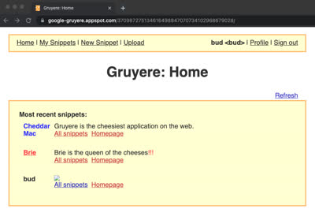

## Security practice

You don't really internalize how security exploits work until you get some practice with them. One way to do this is to use a practice security web applications. There are lots of practice applications but we will discuss two of them, Gruyere and Juice Shop.

## Gruyere

[Gruyere](https://google-gruyere.appspot.com) provides tutorials and practice with things like Cross-site scripting (XSS), Denial of Service (DoS), SQL injection, and elevation of privilege attacks.

Gruyere runs on Google AppEngine and so it is easy to start, play with, and reset when you want to start over.

You can learn about how to use Gruyere by reading the set up [page](https://google-gruyere.appspot.com/part1). Make sure you notice the **Table of Contents** located on the right side of the page in order to learn about the different attacks and how to exploit them.

You start the practice environment by following this [link](https://google-gruyere.appspot.com/start). This will display a page that looks like the following.


For the purposes of this instruction we are only going to talk about the Cross-Site Scripting (XSS) attacks. Feel free to explore everything that Gruyere as your time and interest allows.

### Cross-Site Scripting (XSS)

Open the [Gruyere Instruction](https://google-gruyere.appspot.com/part2) on XSS. Take some time to read the description of XSS attacks and then open up the practice instance of Gruyere that you created above.

Using what we have learned from the tasks, hints, and examples described in the Gruyere instruction, we will create our own XSS attack.

1. Create an account in the Gruyere application using some bogus user name and password.
1. Navigate back to the home page.
1. Select the `New Snippets` option in order to create a snippet that will show on the home screen for all user's of the application.

   The application developers assumed a user would use the snippet functionality to share information about cheese, but you will use it to execute JavaScript for anyone who sees your snippet.

1. Paste the following into the input box and press submit.
   ```html
   
   ```
   

Now, whenever any user of Gruyere goes to their home page they will see your snippet, and it will execute the JavaScript XSS attack and turn their body background color white.



If you logout of Gruyere and create a new user account, you will see that your attack works on all users.

Changing the background color isn't very much of an attack, but it does visually demonstrate that you are in control. You could just have easily grabbed the user's cookie and sent it to a service endpoint where you could start collecting information on Gruyere customers.

```html

```

If you create another snippet with the above example, open up the network tab in the browser's dev tools, and navigate to the Gruyere home page, you will see the browser attempting to send the user's cookie to `hkz.click`.


## Juice Shop


OWASP provides a security training application called [Juice Shop](https://github.com/juice-shop/juice-shop#-owasp-juice-shop). Unlike Gruyere, You need to download the code for Juice Shop and run it from your own computer, but the advantage is that you have complete control over Juice Shop and it is a really good practice application.

If you are at all interested in improving your security skills, you should take the time to install and explore Juice Shop.

### Installing Juice Shop

git clone https://github.com/juice-shop/juice-shop.git --depth 1
