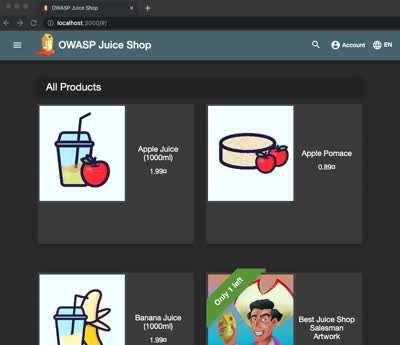

# Security practice

You will not really internalize how security exploits work until you get some practice with them. One way to do this is to use a practice security web applications. There are lots of practice applications but we will discuss [Juice Shop](https://soundcloud.com/braimee/owasp-juice-shop-jingle).

## Juice Shop


OWASP provides a security training application called [Juice Shop](https://github.com/juice-shop/juice-shop#-owasp-juice-shop). To get started you need to download the code for Juice Shop and run it from your own computer. This allows you have complete control over Juice Shop and play Juice Shop whenever you have a spare moment, even when you are offline.

### Installing Juice Shop

1. Clone the Juice Shop repository to your development environment and install the required NPM packages.

   ```sh
   git clone https://github.com/juice-shop/juice-shop.git --depth 1

   cd juice-shop

   npm install
   ```

1. Run the application. This should start Juice Shop on port 3000.
   ```sh
   npm start
   ```
1. You can now open your browser to `localhost:3000`. This will display the Juice Shop application.

   

### Getting started

The idea with Juice Shop is that you are suppose to learn by digging in and experimenting. For a person that is new to security hacking this can be a bit daunting, and so here is a hint to get you started.

You can solve the first hacking challenge by discovering the hidden score board view that shows you all of the possible challenges to solve, and exposes the available tutorials. You can discover where the score board is by examining the contents of the `main.js` file in Dev Tools and seeing that it references a path named `score-board`. So if you change the url to be `localhost:3000/#/score-board` you will see the following view.


You can then find a challenge that looks interesting and try to solve it. Challenges that have a tutorial icon will step you through the challenge and explain how it works. You can then use that knowledge to solve challenges that don't have a tutorial.

To begin, it is suggested that you do the `DOM XSS` tutorial. This will show you how to do a XSS attack using the application search input.
