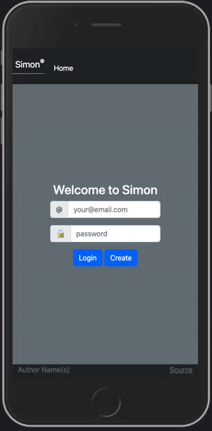

# simon-login


This deliverable demonstrates authenticating users and storing credentials and authentication tokens in MongoDB.

You can view this application running here: [Example Simon Login](https://simon-login.cs260.click)



## Authorization UI

The `public/index.html`, `public/login.js`, and `public/login.css` files provide all the login UI. Bootstrap provides the styling for the controls.

When `index.html` is loaded an anonymous function in `login.js` determines if the user is already authenticated and uses that state to hide or show the login controls.

When a user logs in, logs out, or creates credentials the service endpoints are called.

## Authorization cookie

The application service uses a secure cookie to store the authorization token for an authenticated user.

```js
function setAuthCookie(res, authToken) {
  res.cookie(authCookieName, authToken, {
    secure: true,
    httpOnly: true,
    sameSite: 'strict',
  });
}
```

Note the use of secure, httpOnly, and sameSite. Make sure you are familiar with what each of these mean.

When a user is logged in, the cookie is added. When a user makes a secure request, the cookie is checked. When the user logs out, the cookie is removed.

## Application service endpoints

The service endpoints are contained in `index.js`. The endpoints include `authCreate`, `authLogin`, `authLogout`, and `userGet`. These all work with the database to store and get credentials and update the authorization cookie.

A new Express router, `secureApiRouter` wraps the existing router to add a middleware function that verifies that the authorization cookie is valid before passing the request to endpoints that require authorization. That makes it easy to create secure endpoints by just registering them with `secureApiRouter`.

## Study this code

Get familiar with what this code teaches.

- Clone the repository to your development environment.
  ```sh
  git clone https://github.com/webprogramming260/simon-login.git
  ```
- Set up your environment variables with your Atlas credentials.
- Review the code and get comfortable with everything it represents.
- View the code in your browser by hosting it from a VS Code debug session.
- See how data is populated in the database by viewing the contents of the database using the MongoDB Atlas console.
- Make modifications to the code as desired. Experiment and see what happens.

## Make your own version

- Using VS Code, open the `simon` directory for the repository you used for the last Simon assignment.
- Modify the project and add authentication support. Refer to the example class application repository for guidance. Remember that you do not need to create an original work. Just focus on learning the concepts that the example project provides. However, you will learn more if you type everything out, and not just copy and paste the code.
- Set the footer link to point to your code repository. (e.g. https://github.com/yourname/simon)
- Periodically commit and push your code to your repository as you hit different milestones. (4 commits are required for full credit.)
- Periodically deploy to your production environment using a copy of the `deployService.sh` script found in the [example class application](https://github.com/webprogramming260/simon-login/blob/main/deployService.sh). Take some time to understand how it works.

  ```sh
  ./deployService.sh -k <yourpemkey> -h <yourdomain> -s simon
  ```

  For example,

  ```sh
  ./deployService.sh -k ~/keys/production.pem -h yourdomain.click -s simon
  ```

- Update your `start up` repository README.md to record and reflect on what you learned.
- When you have completed your version. Do a final push of your code and deploy to your production environment using the `deployService.sh` script.
- Make sure your project is visible from your production environment (e.g. https://simon.yourdomain.click).
- Submit the URL to your production environment for grading using the Canvas assignment page.

## Grading Rubric

- 20% - Project hosted from your production environment
- 20% - Interface for creating account, login, and logout
- 20% - Endpoints for authentication operations
- 20% - Successfully uses cookies for authentication token
- 10% - At least four Git commits for the project (Initial, milestone, ..., milestone, final)
- 10% - Notes in your start up repository README.md about what you have learned
