# UX design

Properly considering the user experience (UX) of your application will make all the difference in your success. Focusing first on technology, cost, or revenue tends to lead to an unsatisfying user experience. Instead you want to consider why someone is using your application, how they want to interact, how visually appealing it is, and how easy it is to get something done.

## Design as a story

It is often useful to think of user experience as a story. Consider the background plot, the user entering the stage, interacting with other actors, and getting the audience to applaud. At first this may sound a bit strange, but applications are not used in a vacuum. There is always a reason someone is using your application. If you can clearly define that background plot, then the experience will better match the user's expectation. Likewise, if you know what results in a satisfied audience, then you build the application experience around delivering that result.

Consider the tourism application for the city of Philadelphia. They know a user visits the site because they want to have an experience in Philadelphia. The application immediately provides a time relevant proposal for that experience. All the navigation options for having a successful experience (events, food, deals, and trip planning) are immediately accessible. Just looking at the initial imagery conveys the excitement of engaging in the application.

> Source: [visitphilly](https://www.visitphilly.com/)

## Simplicity

Google broke all the rules for web application design when they released their homepage in 1998.

> Source: Google.com 2022

Previous to that, it was common for app designers to pile everything they could into the initial view of the application. This includes multiple advertisements, navigation options, lots of hyperlinks, and color choices. Here is an example from a competitor around the same time period.

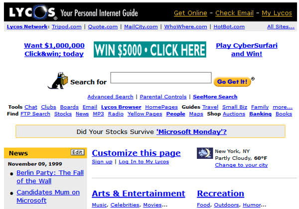

> Source: Lycos.com 1999

The key point of this example, is that simplicity attracts user's attention and engages them in the application experience. Building off of Google's positive reaction, other major applications immediately followed their example. Here is the initial experience when visiting facebook's application for the first time. Notice that it simply states the purpose of the application and invites the user to create an account.

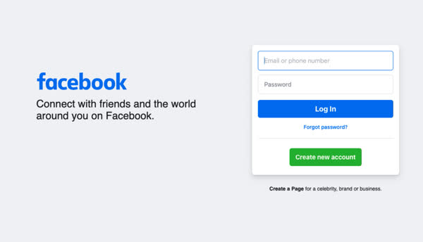

> Source: facebook.com

Simplicity doesn't requires a blank page. Simplicity can also be visually stimulating with beautiful imagery and simple navigation options.

> Source: [Nomadic Tribe](https://nomadictribe.com/)

You can also include significant amounts of content. You just need to keep things focused on a single purpose. For example, creating an account, viewing images, or beginning your travel experience. Below is the Pinterest application landing page. Even though the viewport is cluttered with images, they are all working towards the same purpose of demonstrating the value of the application.

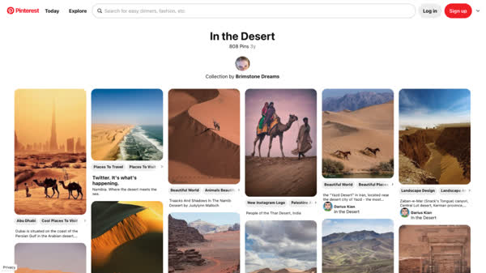

## Consistency

There is a tension that exists with web applications between being consistent with how other applications work and being unique so that your experience stands out. What you want to avoid is being so different that a user has to think hard in order to use your application. This is usually avoided by using the standard conventions that a user expects to find on a web application. The following image describes the `standard layout` and navigation controls of an application.

What a `standard layout` is defined to be will migrate over time as new trends in application fashion seek to make things look fresh. However, if you follow current trends, your users are more likely to engage in your application.

One easy way to build an application that uses current design trends is to use a web framework that provides standard layouts, colors, and iconography. Here is an example of a template application built using a web framework with just a few minutes of work.

## Navigation

A user should never get lost while using your application. To help orient your user you want to carefully design the flow of the application and provide the proper navigational controls.

| Navigation Controls | Description                                           |
| ------------------- | ----------------------------------------------------- |
| App controls        | User settings, payment, and help controls             |
| Device controls     | Device specific controls such as back, next, and home |
| Breadcrumb          | A path of the user's walk through the application     |
| Common actions      | Direct links to locations based on the current view   |

### Application map

The first step in building your application should be to design an application map that has all the views that you will present to the user. This helps clarify the functional pieces of the application and their relationship to each other. For example, if you were building a music player you might start with a landing page that displays some marketing information and allows the user to create an account or login. If the user is already logged in, then they start with a dashboard that shows recent or suggested songs. From there they can either search the music catalog, navigate to a collection of songs based on a playlist, album, or artist, or go to an individual song.

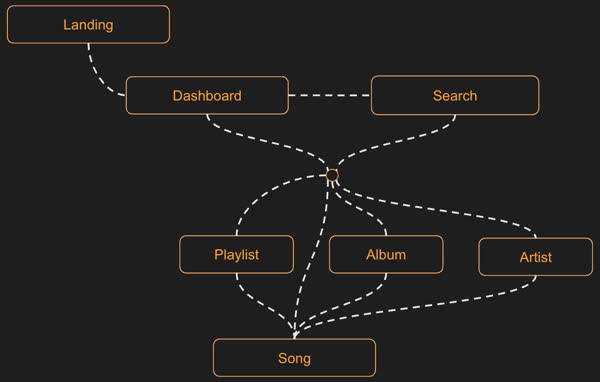

If your application map starts looking like a governmental bureaucracy then you probably want to reconsider the interrelation of functionality. A convoluted application map is a strong indicator that the user experience with be likewise convoluted.

### Device controls

With a concise application map in place, you can design navigational controls that allow the user to successfully use the application. To begin with, you want to make sure the navigational controls provided by the device are completely supported. When your application is hosted in a browser the previous and next buttons should take the user through the stack of visited views. If your application is hosted on a mobile device then the conventions of that device should work properly. For example, on an Android device swiping left and right should navigate the application views backward or forwards.

### Breadcrumb

You always want to indicate where the user is, where they came from, and where they can go. You can do this with a `breadcrumb` control that lists the path the user took to get to where they are.

`Dashboard > Beatles > Abbey Road > Come Together`

A breadcrumb quickly orients the user and also allows them to jump up the navigational path.

### Common actions

You also want to anticipate where a user would commonly want to go based upon the view that they are in. For example, if they are playing a song by one artist, it is common that they will want to view related artists. Therefore you want to provide a navigational link that will take them to a search view with a prepopulated query for related artists.

Commonly accessed views should always be accessible from a standard location. For example, the user settings should always be on the top right, and the breadcrumb should always be on the top left. (Those locations get switched if using a Right-To-Left language.)

You want to partition a large application into functional areas and place links for each area in the navigation bar at the top of the application. For example, if we added the ability to create music to our music application, you would want links that switched between listening to and creating music.

## Colors

One of the first things you should consider as you design your application is the color scheme that you will employ. This usually involves picking a a primary, secondary, and focus color.

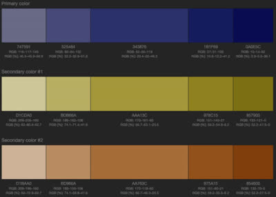

> Source: paletton.com

There are lots of tools out there that help you create a color scheme. These will let you chose monochromatic, adjacent, or triadic color schemes. You can then spin and adjust a color wheel until you get what you are looking for. With your scheme selected you can export the colors directly to CSS rulesets.

Some free tools you should explore include [Paletton](https://paletton.com/) and [Adobe](https://color.adobe.com/create/color-wheel).

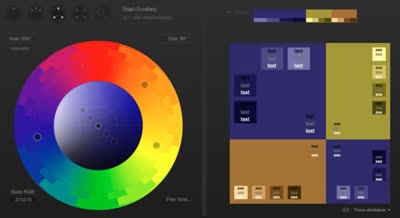

> Source: paletton.com

With your core colors selected, you can use different shades of the colors to reduce the starkness of the limited number of colors without turning your application into a rainbow.

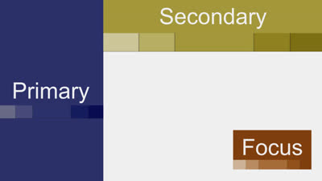

Just make sure you stick with your color scheme and even consider it when selecting font colors and images.

## Typography

A great font will make your application easy on your user's eyes and increase their attention span. Since fonts have been around since the Gutenberg Press, there is some serious history to them. The following shows the different attributes of a font.

> Source: material.io

You can classify fonts into the following groups.

| Font Class  | Example                                        | Meaning                             |
| ----------- | ---------------------------------------------- | ----------------------------------- |
| San Serif   |       | Only major strokes                  |
| Serif       |              | Minor strokes off the major strokes |
| Monospace   |      | All letters have the same size      |
| Handwriting |  | Cursive strokes                     |

> Source: material.io

When picking fonts you usually want to restrict the number of fonts to three or less. You also want to use them consistently. For example, it is common to use a San Serif font for buttons, navigation links, and body text. Serif fonts are used for paragraph headings. Monospaced fonts are for coding examples or text than need alignment.

If you are looking for royalty free fonts that you can use in your application, you should checkout [Google's open collection](https://fonts.google.com/about) of fonts.

## Iconography

Because users will recognize standard icons, you can decrease the learning curve for your application if you use standard web icons to identify common functionality. For example, most users will immediately identify the following three icons as the menu, sharing, and close actions.

Icons not only exploit user recognition, but they also save limited display space, and provide a visually pleasing alternative to text. The important thing is that you pick a set that includes standard icons and that you use them for their intended purpose. Icons become an anti-pattern when they are used to represent something that is contrary to their common usage.

> Source: material.io

There are lots of standard icon packages that you can choose from. This includes packages such as [Font Awesome](https://fontawesome.com/), [Bootstrap Icons](https://icons.getbootstrap.com/), [Material Icons](http://google.github.io/material-design-icons/), Flat [Color Icons](https://github.com/icons8/flat-color-icons), and [Ant Design Icons](https://github.com/ant-design/ant-design-icons)

## Text

You want to be consistent in the size of the text that you use as well as the number of characters displayed on a line. Commonly there are five different catagories of text sizes used by an application. These include the following.

| Purpose        | Size     |
| -------------- | -------- |
| Page title     | 96 px    |
| Titles         | 48-20 px |
| Text           | 16 px    |
| Secondary text | 14 px    |
| Input          | 16 px    |

These sizes are just suggestions but they serve as a good place to start. If you are using an application framework then they will have default text sizes defined. The important thing is that you are consistent with the sizing. Titles should not be one size for a particular view and a different size on another one. Inconsistency confuses the user and makes the application feel haphazardly designed.

### Limiting line length

Limiting the number of characters displayed on a line makes it easier to read paragraphs of text. The browser will automatically wrap text based on the viewport width, but having a line spread across a 4K monitor that is hundreds of characters long will make your application look clunky and drive the user crazy as they try and find the start of the next line in a long paragraph.

Instead you want to specify a maximum width for your paragraphs. Usually a width of 60 to 80 characters is optimal. You can set this with the `max-width` property set to something like `35em`. The `em` unit is the approximately the width of the `m` character in the font and so about half of an 'm' is about the average character width.

The following shows the visual and cognitive impact of different line lengths.

## Internationalization

Designing a global international application requires careful consideration from the beginning. Attempting to internationalize a complex, mature application after it has a domestic presence is very difficult.

One of the most important aspects to consider is the translation of textual content and the ability of the user to select their desired language.

Successful translation also requires the text to be rendered properly. For example, several languages are read from right to left. Therefore the content, and the application itself, must be displayed in that orientation.

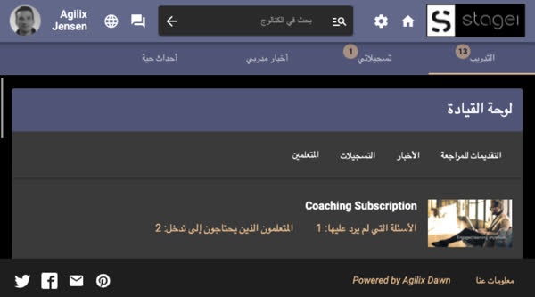

Likewise the format for displaying dates, times, numbers, and currency varies greatly between nationalities. This includes country specific currency symbols (¥, $, €, or ฿), the order of date fields (MM/DD/YY or DD/MM/YY), and numerical separators (1,000.50 or 1.000,50).

Iconography can also be a concern. An owl in the United States represents wisdom, but in some Asian countries it symbolizes stupidity. Icons that carry religious representations can be even more disruptive.

Proper international design requires thought across the full technology stack. If data is not properly passed, stored, and rendered at every level of the stack it will fail to properly work globally. For example, dates and times should always be stored in a format that properly represents time zones (e.g. ISO 8601) and rendered based upon the user's location. That way when users do things like global calendering or traveling between countries their data is not corrupted.

## Space

Introducing space around your application content helps to create focus and lessing the effort a user has to exert in order to interpret the presented information.

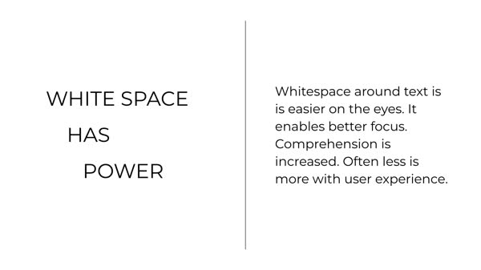

Consider the following example, where whitespace is used to create focus on the brand, imagery, and call to action.

> Source: Prototypr.org

Here is another example where whitespace brings the user's attention to specific text that teases the user and leads them down to the explanatory text, followed by actions the user can take to learn more.

> Source: MadeBySofa.com

Consider the same content with all of the whitespace removed. This is of course extreme, but it demonstrates the power that whitespace has.

## Interaction

Making your application interactive is a powerful way to engage the user and increase retention. Interaction can be as simple as gathering and displaying the user's name or avatar, or as complex as letting the user completely drive the application based on the choices they make.

Here is an example of purchasing a car where the user can interactively see what their car will look like based upon their desires.

> Source: bmw.com

Interaction makes the application come alive and invests the user in the result of their efforts.

## Images

It is often said that a picture can save a thousand words. Including images in your application can convey deeper understanding, make it more visually appealing, and draw a user into the application. The following example, helps the user know exactly what a product looks like and what it might look like when they use it. The contrast of colors in the image helps the product to pop and further suggest its value.

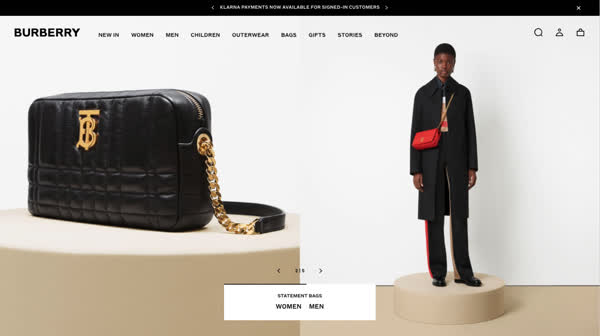

> Source: Burberry.com

Avoid using images that are only used as space fillers. Display space is too limited to waste on an image that doesn't add significant value. For example, the following image dominates the display of a technical article about CORS. However, it was only chosen because it matched the color scheme of the application and the title contains the work `talk` in it, but two people talking trough a tin can has nothing to do with CORS. Now the user has to scroll past the distracting image to get to the content. Instead, either omit the image, or include one that serves to clarify the purpose of CORS. That way your images are visually appealing, and provides information that furthers the story you are trying to tell.

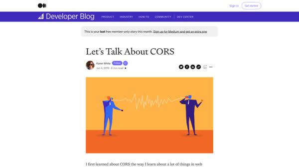

> Source: medium.com

## Animation

Animation can help make your application come alive, but it also helps confirm choices, demonstrate progress, and focus attention.

However, too much animation can physically make your users sick. Here is an example

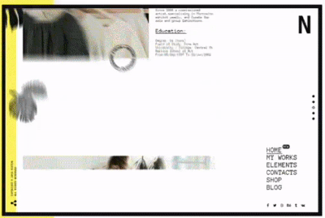

> Source: fireart.studio

## Decision fatigue

You need to consider the impact of the choices that you present to a user. [Hick's Law](https://en.wikipedia.org/wiki/Hick%27s_law) states that the time necessary to make a decision increases logarithmically with the number of choices presented. That doesn't mean that you should not provide options to the user, but that you should limit the number of choices given at any point in time.

For example, the process of building a pizza involves many steps. First you must pick the location you want to order from, then the pizza size, cheese, meats, and veggies. Finally you need to provide payment. Each of those choices require a lot of input from the user, and so limiting the number of choices displayed at one time will help reduce decision fatigue and you will have better odds of them completing the ordering process.

> Source: Papa Johns

## Device aware

Modern devices allow a web application to interact in many sophisticated ways. This includes abilities such as installing to the devices desktop, determining the devices geographical location, displaying notifications, detecting the acceleration of the device, using the camera, and accessing the user's contacts. The more seamless the application is integrated with the device the more intuitive and useful the application will be.

The following shows an application suggesting that the user add the application to the device's home screen. This makes it so a user can access the application without having to navigate to the application's URL.

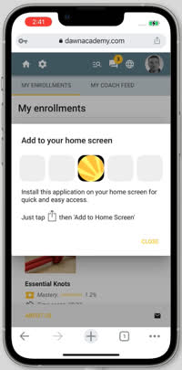

## Device size and orientation

Properly reorienting and altering the functionality of the application interface based upon the size and orientation of the display is especially important on mobile devices. The following shows an application that provides a course on how to tie knots. The default view for the course shows the video on the left and an interactive transcript on the right.

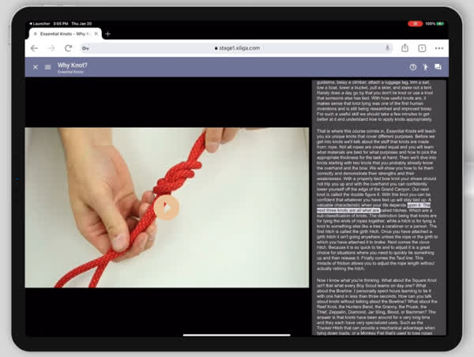

When the device is rotated the application automatically orients itself and moves the interactive transcript below the video in order to maximize the available space. The user can also display the table of contents on the left or the peer chat on the right. Because the device's display is large enough to show the content, even in portrait orientation, the table of contents or chat panes can also occupy a portion of the display. This allows the instructional content to still be visible while the functionality of the other panes are utilized.

On a smaller device, such as a mobile phone, the table of contents or chat panes completely replace the content. The user can then click on the `X` icon to return to the instructional content. That ability to restrict the focus to a single functional purpose, maximizes the use of the limited space without losing the context of the content the user is viewing.

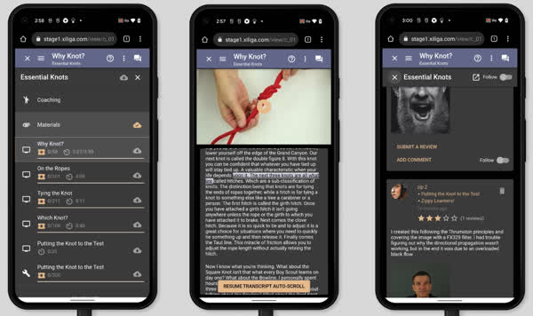

THe following website demonstrates what happens when an application fails to properly adapt to the orientation of the device. When viewed in portrait mode the application only uses a small portion of the display to show a health warning, but when rotated, the warning completely occupies the display. This creates a confusing experience where the original context of the application is obscured, and leaves the user wondering what should be done next.

## Performance

📖 **Suggesting reading**:

- [Google site performance](https://www.youtube.com/watch?v=OpMfx_Zie2g)
- [MDN Performance](https://developer.mozilla.org/en-US/docs/Web/Performance)

Application performance is an important aspect of your design that often gets overlooked until it is too late. Your application can be visually stunning, have intuitive navigation, and amazing interactivity, but if it takes minutes to load or react the a user's actions, it will completely fail. Many studies have analyzed the relationship between performance and user retention. One [study](https://www.thinkwithgoogle.com/marketing-strategies/app-and-mobile/mobile-page-speed-new-industry-benchmarks/) showed that as load times increase from one second to five seconds it causes 90% of the users to bounce, or leave, the application.

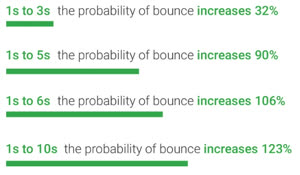

> Source: thinkwithgoogle.com

You need to set performance goals for your application and consistently monitor how your application is doing. Generally you want your application to load in under a second. However, with modern single page web applications it can take several seconds to do the initial load. You can mitigate the appearance of a slow application by giving the impression of progress, by partially loading some content or displaying a loading animation.

The Chrome debugging tools provide a lot of help for diagnosing your application performance. The network tab will show you the size of your application files and the amount of time it takes to transfer them.

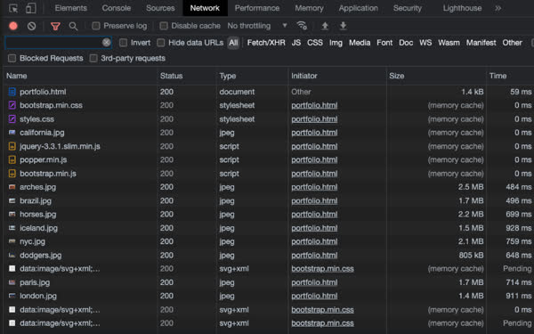

You can use the Chrome debugging Lighthouse tool to run an analysis of your application. This will give you an average performance rating based upon the initial load time, longest content paint, and time before the user can interact with the page.

## Short circuit

Sometimes factors such as network latency will impact the performance of your application or make it partially unavailable. You want to consider how you can create a meaningful experience for your users even when you cannot provide full functionality. For example, your application might relay on a third party service for processing payment before they can access the application. Rather than deny the user access when the payment service is down, you could collect the payment information and attempt to process it later. In the meantime the user is allowed to continue working. If later, the payment processing fails, then you handle the problem just as if their credit card was cancelled after accepting payment.

This ability to provide an alternative path, is sometimes called short circuit or fallback functionality. This removes barriers from your application that otherwise would turn away customers, and they are usually are not difficult to implement. You just need to consider each functional piece of your application and provide an alternative if that functionality is not available.

## Accessibility

📖 **Suggesting reading**: [MDN Accessibility](https://developer.mozilla.org/en-US/docs/Web/Accessibility)

Your application needs to appeal to a diverse population of users. This means that you need to design for users with different accessibility needs, including users with visual, physical, and audible impairments.

You can help users with visual impairments by considering color blindness when selecting your color scheme, providing high contrast themes, and supporting screen readers. Video and audio transcripts, along with visual animation helps users that need audio assistance. Providing keyboard shortcuts and making sure input elements are accessible in the proper order will help users with different physical abilities.

| Ability  | Application features                                    |
| -------- | ------------------------------------------------------- |
| Visual   | High contrast themes, color selection, screen readers   |
| Audio    | Closed captions, textual alternatives, visual animation |
| Physical | Keyboard navigation, element ordering                   |

Many of the accessibility tools that users employ require that your HTML is well structured and has attributes that support [WAI-ARIA](https://developer.mozilla.org/en-US/docs/Learn/Accessibility/WAI-ARIA_basics) standards. Make sure you understand the proper use of elements and aria when you design a production application.

## Legal

Like it or not, applications must consider applicable regulation and the possibility of legal action. For example, by violating GDPR [Amazon was fined $887](https://www.cnbc.com/2021/07/30/amazon-hit-with-fine-by-eu-privacy-watchdog-.html) million in 2021 for violating the privacy of its customers. In another case [Domino's Pizza](https://www.cnbc.com/2019/10/07/dominos-supreme-court.html) was found to be violating the American's with Disabilities Act (ADA) because a blind man could not order a pizza by using a screen reader.

Central to the core of many legal codes is the concept of Personally Identifiable Information (PII). While the strict interpretation of what PII is differs by industry, it generally relates to any data that can be directly ascribed to an identifiably individual.

Every industry and local has different legal constraints. You should be aware of the major legislation that impacts your application. Here are some laws that impact applications within the jurisdiction of the United States of America.

### HIPA

The Health Insurance Portability and Accountability Act (HIPAA) stipulates the management of medical records. It includes provisions that give control to the individual with regard to access and sharing of records. Specifically it restricts how relatives, courts, and insurance companies may obtain medical records.

### FERPA

The Family Educational Rights and Privacy Act (FERPA) defines how student data can be stored, shared, and accessed. FERPA defines the concept of an `education record` and then specifies who can view and contribute to that record.

### ADA

The Americans with Disabilities Act (ADA) seeks to prohibit discrimination against individuals with diverse accessibility needs. The act was originally intended to cover physical environments, but recent case law has extended the interpretation of the law to cover electronic access.

### GDPR

The General Data Protection Regulation (GDPR) impacts all applications that are used by members of the European Union. The main purpose of GDPR is intended to protect the privacy of users. Among other things, GDPR requires applications to get approval from the user before their data can be stored or shared. It also requires the application to provide the ability to delete all of the users data and to be able to transfer their data to competing applications.

## Walls

There are many types of walls that hinder a user's experience with an application. Some walls are caused by poor design or business decisions, and others are a result of unavoidable external pressures such as governmental regulation or security concerns.

If you can learn to recognize user experience walls then there is a good change that you can remove them or decrease their negative impact.

### Complexity

As applications mature it is common for them to grow in complexity as more and more features are introduced.

> A primary cause of complexity is that software vendors uncritically adopt almost any feature that users want.
>
> — Niklaus Wirth

The following image is from GitHub. An important action that a developer needs to do is create a Personal Access Token in order to work with repositories. However, GitHub has buried the UI for creating the token somewhere in their setting (account, user, and repository) pages. Assuming you are able to find the right setting page, you are then confronted with dozens of setting categories. After clicking through all of these options a user will wonder why such an important activity is buried so deeply in the application.

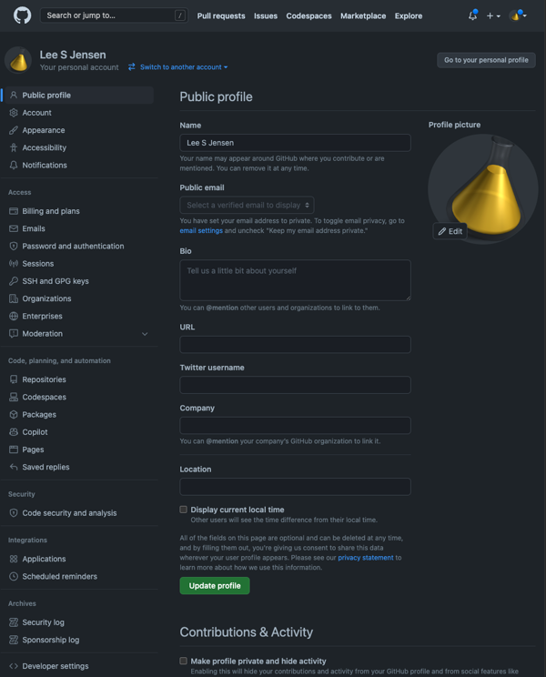

### Payment

Some walls, such as receiving payment, are unavoidable for the success of the application. However, consideration should be made to move the wall to the point where it is required. Before a user hits a payment wall they should have the opportunity to see the value of what they are purchasing. Even better, is if the user is able to invest significant effort and content to the application before payment is required. For example, the application may allow the user to create a limited number of documents before they have to enter payment information.

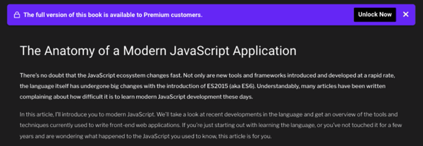

> Source: sitepoint.com

Once payment is required, the process for entering payment information needs to be as effortless as possible. The best option is to have them not enter information at all, and instead use an associated credential like Apple Pay or Google Wallet to authorize payment based on the already authenticated user. Beyond that, a single text box that accepts, and authorizes, a credit card number is better than dozens of text boxes that must be completed before payment is made. You also want to remember payment information so that you don't need to repeatedly as the user for input. This enables you to provide your application as a subscription service, or to execute single click purchases for future payments.

### Application Failure

Application failure is a reality that any good application design needs to address. An application that has a reputation of repeatedly presenting the user with a failure wall will have a hard time retaining users. The most basic solution to handling a failure is to present a message to the user apologizing for what went wrong. The user will be slightly less annoyed if you can explain what went wrong, provide a possible remedy, or explain the expected duration of the failure.

Alternative solutions for handling failure include providing fallback functionality, automatically notifying the user when the failure has been resolved, or providing a status page where the user can go to see what is being done about the problem.

Proactive solutions include designing an application that has multiple redundant regional deployments that automatically failover when one region experiences problems, or designing the application so that it can run offline with cached data.

### Security

Security walls occur when you have to interact with the user in order to authenticate them. The security walls you present should be proportional to the value of the resource you are trying to secure. Banking application should have strong security walls that provide actual protection for the user's data. An application that gives away free kitten videos should have a minimal security wall if any.

You need to consider both the frequency and complexity of your security wall. If the user feels that the security wall is too onerous for the value that the application is providing, they will find another solution. Likewise if the user feels that there is not enough security then they will not trust you with their data.

Here is an example of an application for learning how to code. They need a user's email so that they can store course progress, but they don't even ask for a password because the email address is enough to uniquely identify the user. Authentication occurs when the user provides the security code that is emailed to the address that they provided. From then on the application remembers the email address. If the user accesses the application on a different device then the user just needs to do another once-per-device authentication.

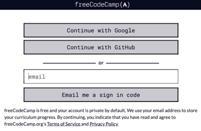

> Source: freecodecamp.com

This a much lower wall than an application that requires you to log in repeatedly every 30 minutes.

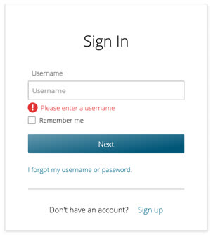

A [CAPTCHA](https://en.wikipedia.org/wiki/CAPTCHA) is a common way to verify that a user is a human. While this may be necessary for the success of your application, it is an example of a wall that provides no value to the user and will always lessen the application experience. This is especially true for a difficult CAPTCHA such as typing in unreadable text, or entering the number of mosquitos displayed in a jungle picture.

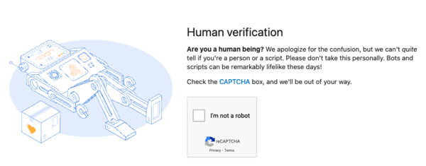

### Legal

Legal walls usually only protect the application vendor and provide little or no value to the user. GDPR inspired cookie notifications are one example of this.

Another common example of a legal wall is an application that requires the acceptance of terms and conditions before you can use the application. You want to minimize the impact of legal walls as much as possible since they lessen the user's experience and encourages the user to question why a legal consent is required in the first place.
