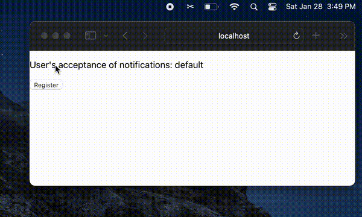

# Device APIs

Every year browsers mature and increase the features that they provide. Sometimes these features are exposed as APIs (Application programming interfaces) that allow a web application to interact with the user through browser, operating system, or device features. For example, your application could take advantage of location services that tell you where your user is physically located, or read a user's contacts in order to allow them to share information with their peers. As these APIs become standard across all browsers they enable web applications to behave more and more like historical native device applications.

## Respecting privacy

Most device APIs require the user to consent to your application's use of the API, but as long as your application is providing value and not just trying to invade the user's privacy, that usually isn't a problem. For example, a good use of location services, would be a restaurant finder application that suggests nearby venues. A bad example of using locations services, would be a Sudoku game that sold your home address to advertisers. In some governmental jurisdictions such uses would be considered illegal.

## Notification API

📖 **Suggested reading**: [MDN Notification API](https://developer.mozilla.org/en-US/docs/Web/API/Notifications_API)

As an example of integrating your web application with the device, let's look at the Notification API.

The following React code has a function to register the user's permission to display notifications, and a function to send notifications. The state representing a user's permission is initialized with the Notification API `permission` property. The state of the property can be `default` (not set), `granted`, or `denied`. If a user grants permission then the `Notification` class may be used to actually display a notification.

The rest of the code controls the UI for the display state, buttons, and message input.

```jsx
function Notifier() {
  const [acceptanceState, updateAcceptanceState] = React.useState(Notification.permission);
  const [msg, updateMsg] = React.useState('');

  function register() {
    Notification.requestPermission().then((response) => {
      updateAcceptanceState(response);
    });
  }

  function notify() {
    new Notification('You are notified', {
      body: msg,
    });
    updateMsg('');
  }

  return (
    <div className='component'>
      <p>User's acceptance of notifications: {acceptanceState}</p>
      {acceptanceState === 'default' && <button onClick={() => register()}>Register</button>}
      {acceptanceState === 'granted' && (
        <div>
          <input type='text' value={msg} onChange={(e) => updateMsg(e.target.value)} placeholder='msg here'></input>
          <button disabled={msg === ''} onClick={() => notify()}>
            Notify
          </button>
        </div>
      )}
    </div>
  );
}
```

Here is what the code looks like in action.



## Location API

📖 **Suggested reading**: [MDN Location API](https://developer.mozilla.org/en-US/docs/Web/API/Geolocation_API/Using_the_Geolocation_API)

The location API provides the GPS location of the device. Like the notification API, the user will be prompted for permission to access their location. After permission is granted then the `navigator.geolocation` API will return the user's location. The rest of the code simply renders a map of where the device is.

```jsx
function Location() {
  const [position, updatePosition] = React.useState({ lat: 0, long: 0 });

  React.useEffect(() => {
    console.log('updating pos');
    navigator.geolocation.getCurrentPosition((p) => {
      updatePosition({ lat: p.coords.latitude, long: p.coords.longitude });
    });
  }, []);

  return (
    <div>
      {position.lat !== 0 && (
        <div>
          <h1>Your location</h1>
          <div>Latitude: {position.lat}</div>
          <div>Longitude: {position.long}</div>
          <div>
            <iframe
              title='map'
              width='425'
              height='350'
              src={`https://www.openstreetmap.org/export/embed.html?bbox=${position.long + 0.001},${
                position.lat + 0.001
              },${position.long - 0.001},${position.lat - 0.001}&amp;layer=mapnik`}
            ></iframe>
          </div>;
        </div>
      )}
      {position.lat === 0 && <div>Location unknown</div>}
    </div>
  );
}
```


## Other APIs

Other interesting device APIs include the [Contact Picker](https://developer.mozilla.org/en-US/docs/Web/API/Contact_Picker_API), [Bluetooth](https://developer.mozilla.org/en-US/docs/Web/API/Bluetooth/requestDevice), and [File System](https://developer.mozilla.org/en-US/docs/Web/API/File_System_Access_API).

Before you get too excited about using any device API make sure you check the current browser support for the API so that you can make sure you properly serve your target market. If a specific device is not supported on some device or browser, you can always hide that functionality for those users while still providing it for others.
