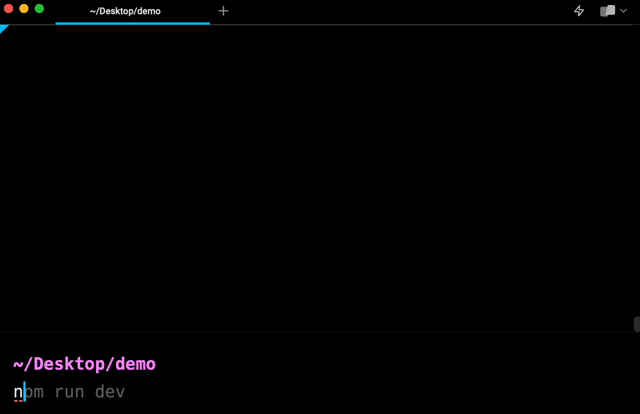
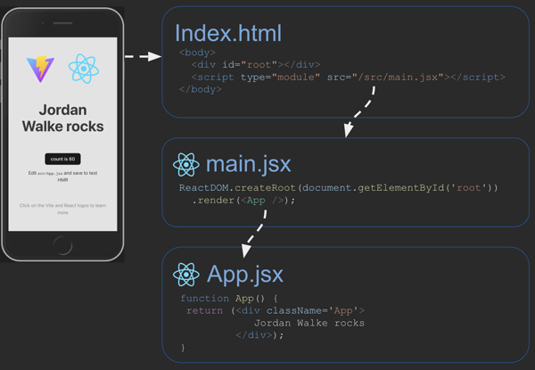
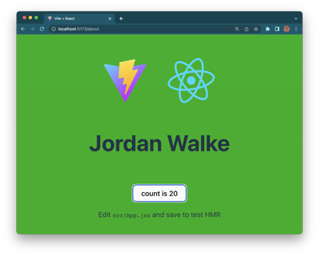

# Vite

📖 **Deeper dive reading**: [Vite](https://vitejs.dev/guide/)

Now that we have covered the basics of React, we want to extend our usage to include a full web framework toolchain that allows us to use JSX, minification, polyfills, and bundling for our Simon and startup applications. One common way for configuring your project to take advantage of these technologies is to use a Command Line Interface (CLI) to initially set up a web application. Using a CLI saves you the trouble of configuring the toolchain parameters and gets you quickly started with a default application.

For our toolchain we are going to use [Vite](https://vitejs.dev/). Vite bundles your code quickly, has great debugging support, and allows you to easily support JSX, TypeScript, and different CSS flavors. To get started with Vite, let's first build a simple web application. Later we will convert Simon over to React using Vite. This will teach you what you need to know in order to move your startup to React.

To create a new React based web application using Vite, open your console and run the following commands:

```sh
npm create vite@latest demoVite -- --template react
cd demoVite
npm install
npm run dev
```

This will create a new web application in the `demoVite` directory, download the required 3rd party packages, and start up the application using a local HTTP debugging server. You can tell Vite to open your browser to the URL that is hosting your application by pressing `o`, or press `h` to see all of the Vite CLI options.



Congratulations! You have just create your first React enabled web application.

Once you have played around with the application in your browser, you can return to your console and stop Vite from hosting the application by pressing `q`.

## Generated project

Now, let's explore the application files that Vite created. From the console, use VS Code (`code .`) to open the project directory and take a look at the files.

| Directory    | File              | Purpose                                                                                                                   |
| ------------ | ----------------- | ------------------------------------------------------------------------------------------------------------------------- |
| ./           | index.html        | Primary page for the application. This is the starting point to load all of the JSX components beginning with `main.jsx`. |
|              | package-json      | NPM definition for package dependencies and script commands. This is what maps `npm run dev` to actually start up Vite.   |
|              | package-lock.json | Version constraints for included packages (do not edit this).                                                             |
|              | vite.config.js    | Configuration setting for Vite. Specifically this sets up React for development.                                          |
| ./public     |                   |                                                                                                                           |
|              | vite.svg          | Vite logo for use as favicon and for display in the app.                                                                  |
| ./src        |                   |                                                                                                                           |
|              | main.jsx          | Entry point for code execution. This simply loads the App component found in `App.jsx`.                                   |
|              | index.css         | CSS for the entire application.                                                                                           |
|              | App.jsx           | JSX for top level application component. This displays the logs and implements the click counter.                         |
|              | App.css           | CSS for the top level application component.                                                                              |
| ./src/assets |                   |                                                                                                                           |
|              | react.svg         | React logo for display in the app.                                                                                        |

The main files in the application are `index.html`, `main.jsx`, and `App.jsx`. The browser loads `index.html` which provides the HTML element (`#root`) that the React application will be injected into. It also includes the script element to load `main.jsx`.

`main.jsx` creates the React application by associating the `#root` element with the `App` component found in `App.jsx`. This causes all of the component render functions to execute and the generated HTML, CSS, and JavaScript to be executed in `index.html`.



## JSX vs JS

The `Vite` CLI uses the `.jsx` extension for JSX files instead of the JavaScript `.js` extension. The Babel transpiler will work with either one, but some editor tools will work differently based upon the extension. For this reason, you should prefer `.jsx` for files that contain JSX. The developers at AirBNB had an interesting [conversation](https://github.com/airbnb/javascript/pull/985) on this topic that you might browse if you would like to consider the differing opinions on this subject.

## Building a production release

When you execute `npm run dev` you are bundling the code to a temporary directory that the Vite debug HTTP server loads from. When you want to bundle your application so that you can deploy to a production environment you need to run `npm run build`. This executes the `build` script found in your `package.json` and invokes the `Vite` CLI. `vite build` transpiles, minifies, injects the proper JavaScript, and then outputs everything to a deployment ready version contained in a distribution subdirectory named `dist`.

```sh
➜  npm run build

> demovite@0.0.0 build
> vite build

vite v4.3.7 building for production...
✓ 34 modules transformed.
dist/index.html                   0.45 kB │ gzip:  0.30 kB
dist/assets/react-35ef61ed.svg    4.13 kB │ gzip:  2.14 kB
dist/assets/index-51439b3f.css    1.42 kB │ gzip:  0.74 kB
dist/assets/index-58d24859.js   143.42 kB │ gzip: 46.13 kB
✓ built in 382ms
```

## Deploying a production release

The deployment script for Simon React (`deployReact.sh`) creates a production distribution by calling `npm run build` and then copying the resulting `dist` directory to your production server.

Take some time to build a production release by running `npm run build`. Then examine what Vite actually builds by examining the `dist` directory. For example, if you look at the `dist/assets` directory you will see the bundled and minified JavaScript and CSS files.

## ☑ Assignment

Now that you have reviewed the application in VS Code, take a moment to manipulate the files and see what impact your changes have. If you break the application, and can't figure out how to fix it, just delete the demo directory and start again. The more you play around with this code, the better you will understand how all the pieces of the application fit together.

Make the following modifications:

1. Alter the CSS to change background and text colors to something different.
1. Replace the text in the App component with your name.
1. Change the counter to increment by 10 instead of by one.

After these changes, the application should look similar to this:



When you are done, submit a screen capture of the altered application to the Canvas assignment.

Don't forget to update your GitHub startup repository notes.md with all of the things you learned and want to remember.
