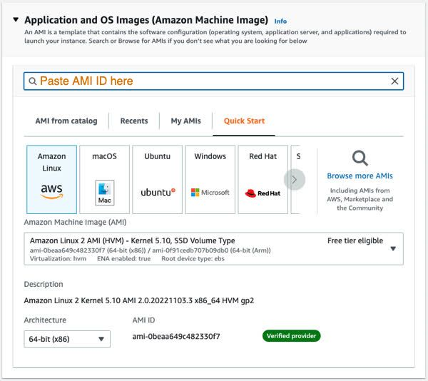
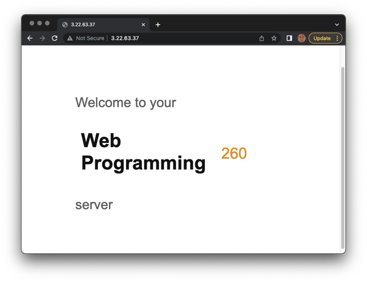
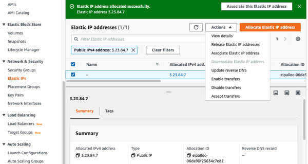

# Amazon Web Services - EC2

Now that you know all about web servers, it is time for you to rent your own. In theory you could contact your ISP and rent an IP address that you would associate with your laptop. You could then use your laptop as a web server. But this has the downside of requiring your laptop to always be available, have enough bandwidth to support your millions of fans, and creates a significant security risk for your laptop. Instead we want to use a cloud provider that can give you an inexpensive small computer that you can experiment with and throw away any time that you would like. This is actually exactly what many web companies do with their core business and so it should work fine for you.

We are going to use Amazon Web Services (AWS) for your work with this instruction. There are lots of other great vendors out there, but AWS is by far the leader in the space and so it is good for you to get experience with them. This will require you to have an account with AWS.

## What is this going to cost you?

There is no cost to create an account with AWS, you only pay for what you use, and in many cases they will give you a significant starting credit and [some services are free](https://aws.amazon.com/free) for a short period of time or monthly usage. The services we are going to use include the following:

| Service        | Purpose                              | Estimated Cost (subject to change)                                   |
| -------------- | ------------------------------------ | -------------------------------------------------------------------- |
| EC2            | Server                               | t3.nano $0.0052 an hour, ($3.50/month)                               |
| EC2 Elastic IP | Keep your IP address between reboots | First one is free if you keep it associated with a running server    |
| Route 53       | Domain name                          | $3/year for `click` tld. More for others                             |
| Route 53       | DNS records                          | $0.50 a month for each root domain                                   |
|                |                                      | Estimated total: `$15` for the course. Much cheaper than a textbook. |

As mentioned before, there are lots of ways to get free usage of services. For example, as of when this was written, you can get a 750 hours a month, for the first 12 months, of a Linux t2.micro or t3.micro server instance.

## AWS Credit Grants and AWS Educate Starter Account

AWS has a couple of programs to help students try out their services. If you don't want to supply a credit card you can enroll in a 3rd party administrated program called AWS Educate Starter Account. This program allows you to create an account that comes with a $75 credit and doesn't require a credit card. Alternatively, if you already have an AWS account or want to just get a regular account without involving a 3rd party, you can apply for a $100 grant from AWS and apply it to your account.

Refer to [this article]https://it.newschool.edu/services/learning-resources/aws-amazon-web-services/claim-your-aws-educate-grant) for the details on these programs.

## Creating an AWS server instance

Once you have an AWS account it is time to create your web server.

⚠ Note that the AWS interface changes all of the time and so the images given below may not match what you see. However, the concepts they represent should all be there in some shape or form.

1. Open the AWS console in your browser and log in.
1. Navigate to the EC2 service.
1. Select the option to `Launch instance`.
1. Give your instance a meaningful name. Perhaps use a convention such as [owner]-[purpose]-[version].

   

1. We have created an Amazon Machine Image (AMI) for you to use as the base for your server. It has Ubuntu, Caddy Server, and PM2 built right in so that you do not have to install them. Paste this AMI ID (`ami-0badcce4ae7d504a1`) into the search box and press enter.

   

   This should display the information about the class AMI. If the AMI ID matches, select it.

   

1. Select t3.nano for the instance type. You can always change this later if you need more power.

   

1. Create a new key pair. Make sure you save the key pair to your development environment. This needs to be safe a place that is not publically accessible and that you won't accidentally commit to a GitHub repo. You will need this every time you secure shell (ssh) into this server (production environment). Note that you don't have to create a new key pair every time you launch an instance. You can use one that you created previously so that all of the servers you create can be accessed with the same key file.

   

1. For the network settings, make sure `auto-assign public IP` address is enabled. For the `Firewall (security group)`, if this is the first server that you are creating then select the option to `Create security group`. Allow SSH, HTTP, and HTTPS traffic from anywhere. If you have created a server before then you already have a security group that you can use and should not clutter up your account with additional ones. In that case use the option to `Select existing security group` and select the name of the exiting security group.

   A security group represents the rules for allowing access to your servers. Security group rules specify both the port that is accessible on your server, and the source IP address that requests are allowed from. For example, you could allow only port 443 (the secure HTTPS port) from your development environment's IP address. However, doing so would mean that your web application would not be available from any other computer. You can learn more about security groups from the [AWS documentation](https://docs.aws.amazon.com/vpc/latest/userguide/VPC_SecurityGroups.html).

   

1. Select the option to `Launch instance`.

It will take a few minutes for the instance to start up, but once it is marked as `running` it is good to go. Look at the properties for the instance and note the public IP address.

Open your browser and paste the public IP address for your server in the location bar. You should see the following.



If that is what you see then congratulations. You are now running your very own web server that the whole world can see! Time to celebrate with cookies.

## SSH into your server

New let's shell into your server and see what is under the hood. Go to your console window and use SSH to shell into the server. You will need to supply the public IP address (copied from the EC2 instance details) and the location of your key pair file that you created/used when you launched your instance. _Hopefully you saved that off to a safe location in your development environment, otherwise you will need to terminate your instance and create a new one, with a new key._

```sh
➜  ssh -i [key pair file] ubuntu@[ip address]
```

⚠ You may get a warning that your key pair file permissions are too open. If so then you can restrict the permissions on your file so that they are not accessible to all uses by running the `chmod` console command: `chmod  600 [key pair file]`.

⚠ As it connects to the server it might should warn you that it hasn't seen this server before. You can confidently say yes since you are sure of where this server is coming from.

Once it has connected you are now looking at a console window for the web server that you just launched and you should be in the ubuntu user's home directory. If you run `ls -l` you should see the following.

```sh
ls -l
total 4
lrwxrwxrwx 1 ubuntu ubuntu   20 Nov 17 23:03 Caddyfile -> /etc/caddy/Caddyfile
lrwxrwxrwx 1 ubuntu ubuntu   16 Nov 17 03:42 public_html -> /usr/share/caddy
drwxrwxr-x 6 ubuntu ubuntu 4096 Nov 30 22:42 services
```

The `Caddyfile` is your configuration file for your web service gateway. The `public_html` directory contains all of the static files that your are serving up directly through Caddy when using it as a web service. We will cover Caddy configuration in later instruction. The `services` directory is the place where you are going to install all of your web services once you build them.

Once you are done poking around on your server you can exit by running the `exit` command. That is everything. You don't need to touch anything on your server. Remember that should always do using an automatic continuous integration process.

## Keeping the same public IP address

You can stop your server at any time. Don't confuse this with terminating your server which completely destroys it. Stopping your server just powers down the device. This is nice because you don't have to pay for it while it is stopped. However, every time you stop and start your server you we be assigned a new public IP address. It is important to keep the same public IP address so that you, and other, can always browse to the same place, and more importantly so that when you create your domain name you can assign it to an address that never changes.

You have two choices in order to keep the same public IP address.

1. Never stop your server.
2. Assign an elastic IP address to your server so that it keeps the same address even if you stop it.

Your first elastic IP address is free. However, the catch is that it is only free while the server instance it is assigned to is running. While your server is not running you are charged $0.005/hr. This is the same cost for running a t3.nano server instance. So you don't save any money unless you start running a more powerful instance, and are stopping your instance when you, or the TAs, don't need it.

We would suggest that do both. Keep your server running and associate an elastic IP. That way if you do need to reboot it for some reason, you will still keep the same IP address and it doesn't cost you anything different either way.

Here is how you assign an elastic IP address to your server instance.

1. Open the AWS console in your browser and log in.
1. Navigate to the EC2 service.
1. From the menu on the left select `Network & Security|Elastic IPs`.
1. Press the `Allocate Elastic IP address` button.
1. Press the `Allocate` button.
1. Select the newly displayed allocated address and press the `Actions` button.
1. Select the `Associate Elastic IP address` option.

   

1. Click on the `Instance` box and select your server instance.
1. Press `Associate`.

Note that your elastic IP address is allocated until your release it, not until you terminate your instance. So release it when you no longer need it. Otherwise you will get a nasty $3 bill every month.

Also note that your server IP address has changed to the newly allocated one. This is the one you will use from now on.

## ☑ Assignment

1. Create your AWS account.
1. Create an EC2 instance using the class AMI.
1. Test that you can see the default class web page from a browser.

Submit a URL using your web server's public IP address, along with a description of something you found interesting, to the Canvas assignment.

Don't forget to update your GitHub startup repository README.md with all of the things you learned and want to remember.
