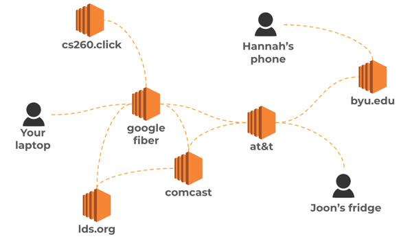
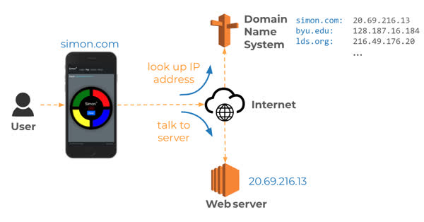

# The internet

📖 **Suggested reading**:

- [MDN How does the Internet work?](https://developer.mozilla.org/en-US/docs/Learn/Common_questions/How_does_the_Internet_work)
- [YouTube The Internet in 5 Minutes](https://youtu.be/7_LPdttKXPc)

The internet globally connects independent networks and computing devices. In a simplistic way, you can think of the internet as a massive redundant collection of wires that connect up all the computers in the world. A lot of those wires are wireless (wiFi, satellite, or cell), and not all of computers in the world are connected, but generally that is what the internet is. The deeper your mental model of the internet is, the more effectively you will be able to create web applications.



## Making connections

When one device what to talk to another it must have an IP address. For example, `128.187.16.184` is BYU's address. Usually, human users prefer a symbolic name over an IP address. The symbolic name is called a domain name. Domain names are converted to IP address by doing a lookup in the Domain Name System (DNS). You can look up the IP address for any domain name using the `dig` console utility.

```sh
➜  dig byu.edu

byu.edu.		5755	IN	A	128.187.16.184
```



Once you have the IP address, you connect to the device it represents by first asking for a connection route to the device. A connection route consists of many hops across the network until the destination is dynamically discovered and the connection established. With the connection the transport and application layers start exchanging data.

### Traceroute

You can determine the hops in a connection using the `traceroute` console utility. In the following example, we trace the route between a home computer and BYU. In the result you see the first address `192.168.1.1`. This is the address of the network router the home computer is connected to. From there it goes through a couple devices that do not identify themselves and then hits the Google Fiber gateway. Google Fiber is the internet service provider, or ISP, for the requesting device. Then we jump through a few more unidentified devices before finally arriving at BYU (`128.187.16.184`).

```sh
➜  traceroute byu.edu

traceroute to byu.edu (128.187.16.184), 64 hops max, 52 byte packets
 1  192.168.1.1 (192.168.1.1)  10.942 ms  4.055 ms  4.694 ms
 2  * * *
 3  * * *
 4  192-119-18-212.mci.googlefiber.net (192.119.18.212)  5.369 ms  5.576 ms  6.456 ms
 5  216.21.171.197 (216.21.171.197)  6.283 ms  6.767 ms  5.532 ms
 6  * * *
 7  * * *
 8  * * *
 9  byu.com (128.187.16.184)  7.544 ms !X *  40.231 ms !X

```

If I run traceroute again I might see a slightly different route since every connection through the internet is dynamically calculated. The ability to discover a route makes the internet resilient when network devices fail or disappear from the network.

## Network internals

The actual sending of data across the internet uses the TCP/IP model. This is a layered architecture that covers everything from the physical wires to the data that a web application sends. At the top of the TCP/IP protocol is the application layer. It represents user functionality, such as the web (HTTP), mail (SMTP), files (FTP), remote shell (SSH), and chat (IRC). Underneath that is the transport layer which breaks the application layer's information into small chunks and sends the data. The actual connection is made using the internet layer. This finds the device you want to talk to and keeps the connection alive. Finally, at the bottom of the model is the link layer which deals with the physical connections and hardware.

### [TCP/IP](https://en.wikipedia.org/wiki/Internet_protocol_suite) layers

| Layer       | Example         | Purpose                               |
| ----------- | --------------- | ------------------------------------- |
| Application | HTTPS           | Functionality like web browsing       |
| Transport   | TCP             | Moving connection information packets |
| Internet    | IP              | Establishing connections              |
| Link        | Fiber, hardware | Physical connections                  |
