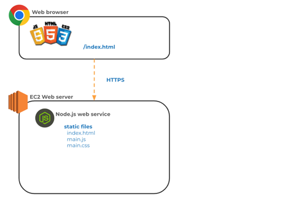
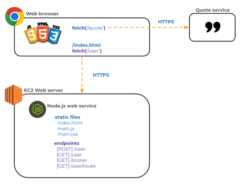

# Web services introduction

Up to this point, your entire application is loaded from your web server and ran on the user's browser. It starts when the browser requests the `index.html` file from the web server. The `index.html`, in turn references other HTML, CSS, JavaScript, or image files. All of these files, that are running on the browser, comprise the `front-end` of your application.

Notice that when the front-end requests the application files from the web server it is using the HTTPS protocol. All web programming requests between devices use HTTPS to exchange data.

From our front-end Javascript we can make requests to external services running anywhere in the world. This allows us to get external data, such as an inspirational quote, that we then inject into the DOM for the user to read. To make a web service request, we supply the URL of the web service to the `fetch` function that is built into the browser.

The next step in building a full stack web application, is to create our own web service. Our web service will provide the static front-end files along with functions to handle `fetch` requests for things like storing data persistently, providing security, running tasks, executing application logic that you don't want your user to be able to see, and communicating with other users. The functionality provided by your web service represents the `back-end` of your application.

Generally the functions provided by a web service are called `endpoints`, or sometimes APIs. You access the web service endpoints from your front-end JavaScript with the fetch function. In the picture below, the back-end web service is not only providing the static files that make up the front-end, but also providing the web service endpoints that the front-end calls to do things like get a user, create a user, or get high scores.

The back-end web service can also use `fetch` to make requests to other web services. For example, in the image below the front-end uses fetch to request the user's data from the back-end web service. The back-end then uses fetch to call two other web services, one to get the user's data from the database, and another one to request subway routes that are near the user's home. That data is then combined together by the back-end web service and returned to the front-end for display in the browser.

In following instruction we will discuss, how to use fetch, HTTP, URLs, and build a web service using the Node.js application. With all of this in place your application will be a full stack application comprised of both a front-end and a back-end.
